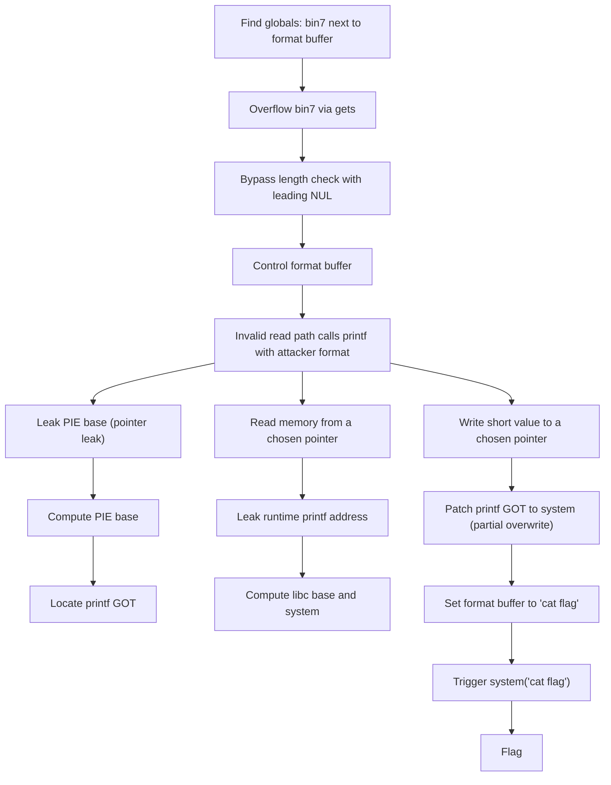
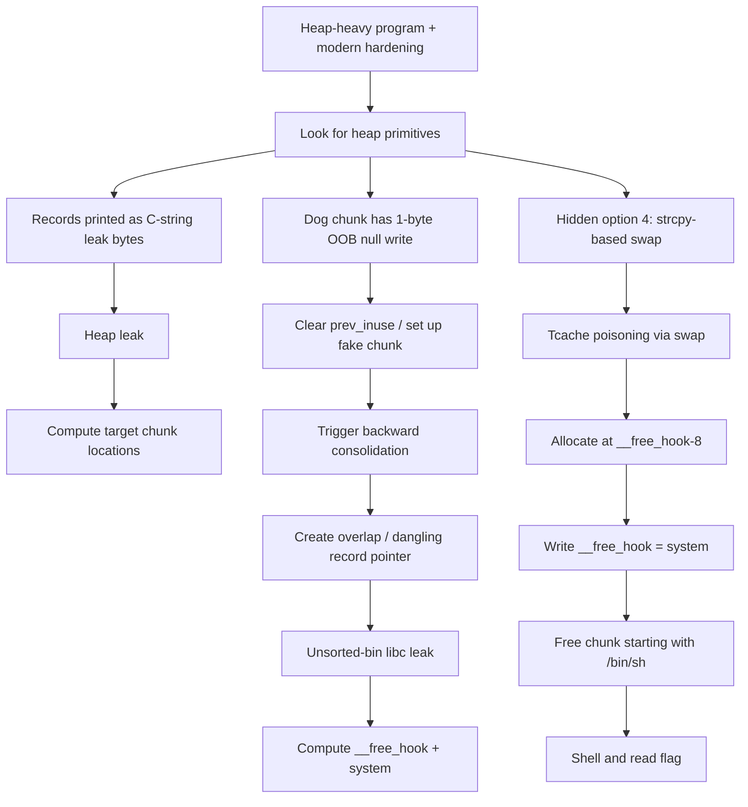
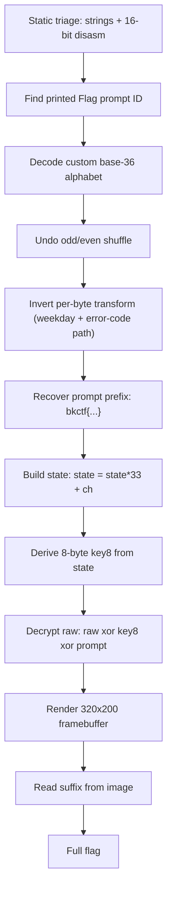

:::caution
Spoilers ahead. This post includes solution details (and flags).
:::

I picked three challenges that felt very "classic CTF": one format-string chain, one glibc heap chain, and one retro DOS reverse.

---

## [Pwn] igetsit

| Item | Value |
| --- | --- |
| Bug | `gets()` overflow + format string sink |
| Win condition | Turn `printf(fmt, ...)` into `system(fmt)` |

### What I noticed

The program keeps 8 global "bins" (`bin0..bin7`) where the size doubles each index. The interesting detail is placement: a global format buffer lives right after the biggest bin (`bin7`) in `.data`.

That means:
- if I can overflow `bin7`, I can overwrite the format string
- if the program ever does `printf(format, something)`, I get a format-string primitive

### Bug 1: `gets()` plus a fake length check

The write path uses `gets(binX)` and then tries to "validate" with `strlen(binX)`.

The check is bypassable because `gets()` writes bytes first, but `strlen()` only cares where the first `\0` is.

So I sent input that starts with a null byte:

```text
\x00AAAA....(lots of bytes)
```

`strlen()` returns 0, the check passes, and the overflow still happens.

### Bug 2: format string sink on an invalid menu choice

The read path asks how to print a value (int/float/string/pointer). If I give an invalid option, it prints an error but still executes something like:

```c
printf(readFormat, value);
```

Once `readFormat` is under my control, this becomes:
- leaks: `%p`, `%s`
- writes: `%hn`, `%hhn`

### Exploit chain (high level)

1. Overflow `bin7` to overwrite `readFormat`.
2. Leak PIE with a stack pointer leak (I used `%10$p`) and compute the binary base.
3. Read `printf@GOT` with `%1$s` by placing the target address in a bin.
4. Compute libc base and `system`.
5. Partially overwrite `printf@GOT` to point to `system` (a small 2-byte patch).
6. Set `readFormat` to `cat flag` and trigger the invalid read option.

:::warning
The reason partial GOT overwrite is nice here: the program calls `printf` a lot, so a full 8-byte rewrite is noisy. Changing only the middle bytes was enough for this libc.
:::

### Concept map



:::note[Flag]
`bkctf{g0_g3ts()_y0ur_bag_gIr1}`
:::

::github{repo="Gallopsled/pwntools"}

---

## [Pwn] Dogtrack

| Item | Value |
| --- | --- |
| Libc | glibc 2.27 (tcache) |
| Core bugs | off-by-null + hidden swap primitive |
| Final | tcache poison -> `__free_hook = system` |

### Why I went for heap

The binary is hardened enough that "just ret2win" is not the path (PIE/NX/canary/RELRO). But it allocates and frees objects all the time, and a few tiny mistakes give heap primitives.

### The two key primitives

1) A one-byte out-of-bounds null write after a dog chunk.

That lets you clear the `prev_inuse` bit of the next chunk and set up backward consolidation.

2) A hidden Hall of Fame option (menu option 4) that swaps records using `strcpy`.

Once you can make a record pointer dangle/overlap freed memory, a sloppy string-copy swap is a great way to stomp heap metadata.

### Exploit chain (high level)

1. Get a heap leak by abusing a record printer that treats chunk bytes as a C-string.
2. Use off-by-null to prepare a fake chunk and trigger backward consolidation.
3. Use the overlap to leak libc from unsorted-bin pointers.
4. Poison a tcache `next` pointer using the hidden swap feature.
5. Allocate onto `__free_hook - 8`, write `system` into `__free_hook`.
6. Free a chunk whose bytes start with `/bin/sh`.

### Concept map



:::note[Flag]
`bkctf{7h3_r4w35t_0f_h07d0G5}`
:::

::github{repo="bminor/glibc"}

---

## [Rev] IMGGEN81

| Item | Value |
| --- | --- |
| Artifact | `IMGGEN81.EXE` (16-bit DOS) |
| Idea | recover hidden prompt prefix, then decrypt a raw 320x200 framebuffer |
| Output | a decrypted image that contains the missing flag suffix |

### The shape of the solution

This one is basically two stages:

1. Prompt -> "prompt ID" encoder (custom base-36 + shuffle + per-byte transform)
2. Framebuffer decrypt (DJB2-ish state -> 8-byte keystream)

Once I reversed the encoder, I could invert it to recover a real prompt prefix that already looks like a flag.

Then I used that prompt to generate the keystream and XOR-decrypt `flag.raw`.

### Stage 1: invert the prompt ID

The binary prints a long "Flag prompt ID" string.

I found its alphabet:

```text
0123456789aBcDeFgHIjkLmNoPQRsTuVwXyZ
```

It packs bytes into 16-bit chunks and emits 4 base-36 digits per chunk (little-endian digit order), then maps each digit through the alphabet.

Before packing, it also does:
- a per-byte transform (`xor` with a weekday-derived byte, then add a derived offset)
- an odd/even shuffle

Inverting those steps gave me a stable prompt prefix:

```text
bkctf{h3yy_4r3nt_y0u_7h3_
```

### Stage 2: decrypt the 320x200 image

The decrypt stage updates a 64-bit state with:

```text
state = state * 33 + byte
```

Then it turns `state` into an 8-byte key (`key8`), and decrypts the raw framebuffer like:

```text
dec[i] = raw[i] xor key8[i%8] xor prompt[i%len(prompt)]
```

After rendering the decrypted bytes as a 320x200 image, the rest of the flag is visible as stylized text.


### Concept map



:::note[Flag]
`bkctf{h3yy_4r3nt_y0u_7h3_05_fr0m_051h_4r0und?}`
:::

::github{repo="dosbox-staging/dosbox-staging"}
