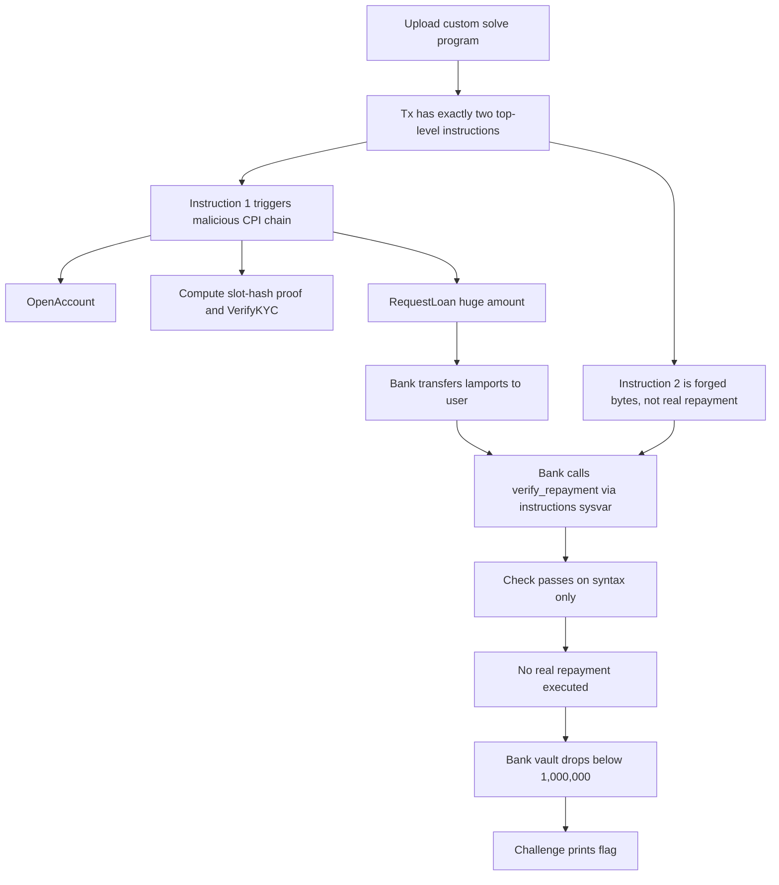

:::caution
Spoilers ahead. This post includes solution details (and flags).
:::

## [Blockchain] Bank Heist

| Item | Value |
| --- | --- |
| Service | `nc 20.193.149.152 5000` |
| Goal | Drain the bank vault below a threshold |
| Core bug | Repayment verification checks bytes, not semantics |

### What the challenge gives you

The server lets you upload a custom Solana program (SBF `.so`) and send exactly **two** top-level instructions. That already smells like an **instruction-introspection** bug.

### The key mistake (repayment verification)

The bank does a normal transfer from its vault PDA to the user, then tries to verify that the *next instruction* repays the loan.

The check is basically:
- read the next instruction from the `instructions` sysvar
- ensure `data[0..4] == 2` (assumed to mean "system transfer")
- ensure the amount is big enough
- ensure `accounts[1]` is the bank vault

But it **does not** verify that the next instruction is actually a System Program transfer (`program_id == 111111...`).

Here is the vulnerable part (trimmed):

```rust
let discriminant = u32::from_le_bytes(next_ix.data[0..4].try_into().unwrap());
let amount = u64::from_le_bytes(next_ix.data[4..12].try_into().unwrap());

if discriminant != 2 {
    return Err(ProgramError::InvalidInstructionData);
}

let destination_meta = &next_ix.accounts[1];
if destination_meta.pubkey != *bank_pda {
    return Err(ProgramError::InvalidAccountData);
}
```

:::warning
On Solana, "the next instruction looks like repayment" is not the same as "repayment happened".
:::

### My exploit idea

I used both allowed instructions like this:

1. **Instruction #1** (to my uploaded solve program): CPI into the bank program to:
   - open my account
   - pass KYC (the proof is computable from `slot_hashes`)
   - request a large loan

2. **Instruction #2** (also to my solve program): a no-op call whose **data bytes** are crafted to *look like* a System Program transfer payload and whose account metas put the bank vault at index 1.

The bank reads the sysvar, sees "a valid repayment instruction", and accepts the loan path.
But the second instruction never repays anything.

### Concept map



:::note[Flag]
`BITSCTF{8ANk_h3157_1n51D3_A_8L0cK_ChA1n_15_cRa2Y}`
:::

### Defensive notes (how to fix)

- Validate `next_ix.program_id == system_program::id()`.
- Decode the transfer properly (don’t guess by a magic number).
- Validate source account + signer constraints.
- Prefer explicit escrow / balance-delta checks over sysvar-introspection.

::github{repo="otter-sec/sol-ctf-framework"}

---

## [Pwn] Mind The Gap

| Item | Value |
| --- | --- |
| Remote | `chals.bitskrieg.in:24295` |
| Bug | Stack overflow in a tiny x86-64 binary |
| Final technique | Stack pivots + 2-byte GOT overwrite + SROP |

### Vulnerability

The binary reads 0x200 bytes into a 0x100 stack buffer, then ends with `leave; ret`.

```text
sub rsp, 0x100
...
read(0, rbp-0x100, 0x200)
...
leave
ret
```

With no canary and no PIE, I can control saved `rbp` and `rip` and pivot into a stable writable region.

### Why this exploit is fun

This was a “low gadget” binary, so I leaned on three ideas:

1. **Repeated `leave; ret` pivots** to move my stack into predictable writable memory.
2. **Partial GOT overwrite (2 bytes)** to redirect `read@plt` into a libc `syscall; ret` gadget while staying ASLR-safe.
3. **SROP** to load all registers at once and call `execve("/bin/sh", 0, 0)`.

:::tip[SROP in one sentence]
If I can make a syscall with `rax=15` (`rt_sigreturn`) and a fake signal frame on the stack, I can set almost every register in one shot.
:::

After I got a shell, I read the flag from the filesystem.

### Concept map

```mermaid
flowchart TD
    A[Overflow in main: read 0x200 into 0x100] --> B[Overwrite saved RBP + RET]
    B --> C[Pivot with leave;ret to controlled pages]
    C --> D[Stage data at c00100 and c00400]
    D --> E[2-byte overwrite read@got low16]
    E --> F[read@plt now jumps to syscall;ret]
    F --> G[First syscall is read -> returns 15]
    G --> H[Second syscall number 15 -> rt_sigreturn]
    H --> I[Load SigreturnFrame]
    I --> J[Set rax=59 rdi=/bin/sh rip=read@plt]
    J --> K[execve(/bin/sh,0,0)]
    K --> L[cat flag paths]
    L --> M[BITSCTF flag]
```

:::note[Flag]
`BITSCTF{c21090e2034f279a241db1327ecd5775}`
:::

::github{repo="Gallopsled/pwntools"}

---

## [Rev] safe not safe

| Item | Value |
| --- | --- |
| Remote | `nc 135.235.195.203 3000` |
| Given | Firmware dump (ARM Linux zImage + initramfs) |
| Core weakness | Time-seeded RNG used for reset challenge/response |

### The story

The service implements a "smart safe" with a password reset option. The firmware includes a SUID binary that prints:
- current time
- a challenge code

Then it asks for a numeric response.

### My approach

1. Identify the artifact and extract the initramfs (binwalk + cpio).
2. Find and reverse the SUID safe app.
3. Rebuild the reset math and PRNG **exactly** (call order and 32-bit overflow).
4. Compute the correct response from the printed challenge code and submit it.

The important equations are:

```text
challenge_code    = mask xor A
expected_response = mask xor B

=> response = (challenge_code xor A) xor B
```

### Concept map

```mermaid
flowchart TD
    A[Firmware dump] --> B[Extract zImage payload]
    B --> C[Extract initramfs cpio]
    C --> D[Inspect /init]
    D --> E[Find SUID /challenge/lock_app]
    E --> F[Reverse reset routine]
    F --> G[time seed -> shuffled S-box]
    F --> H[/dev/urandom 4-byte mask]
    G --> I[sub(rand1), sub(rand2)]
    I --> J[A = ((sub1*31337 low32)+sub2) mod 1e6]
    I --> K[B = (sub1 xor sub2) mod 1e6]
    H --> L[challenge = mask xor A]
    H --> M[response  = mask xor B]
    L --> N[mask = challenge xor A]
    N --> O[response = mask xor B]
    O --> P[Send code to remote]
    P --> Q[Gift prints flag]
```

:::important
32-bit overflow mattered here. If you compute `sub1 * 31337` with unbounded integers, you get the wrong result.
:::

:::note[Flag]
`BITSCTF{7h15_41n7_53cur3_571ll_n07_p47ch1ng_17}`
:::

::github{repo="ReFirmLabs/binwalk"}

::github{repo="qemu/qemu"}

---

## Closing thoughts

BITSkrieg had a nice mix of “real bug” exploitation across very different environments:
- Solana transaction logic (syntactic verification pitfalls)
- a tiny pwn binary (pivots + SROP)
- firmware reversing (initramfs + weak RNG)

If you want, I can write separate deep-dive posts for each challenge (with cleaner diagrams and trimmed exploit code).
