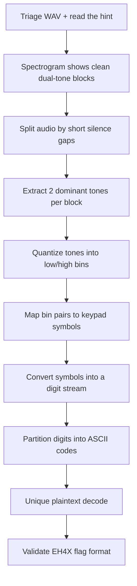
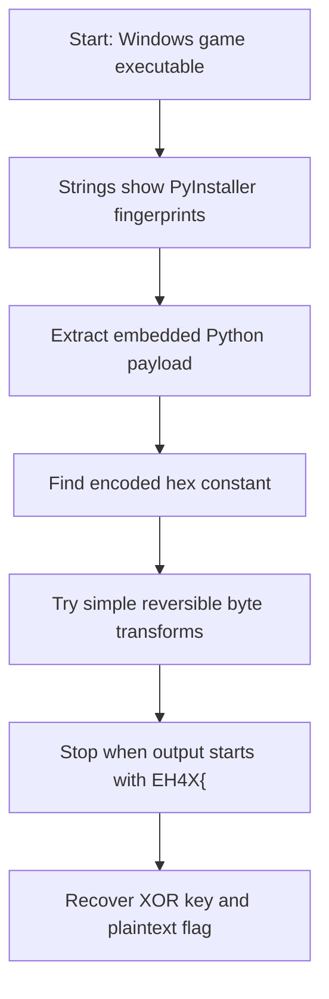
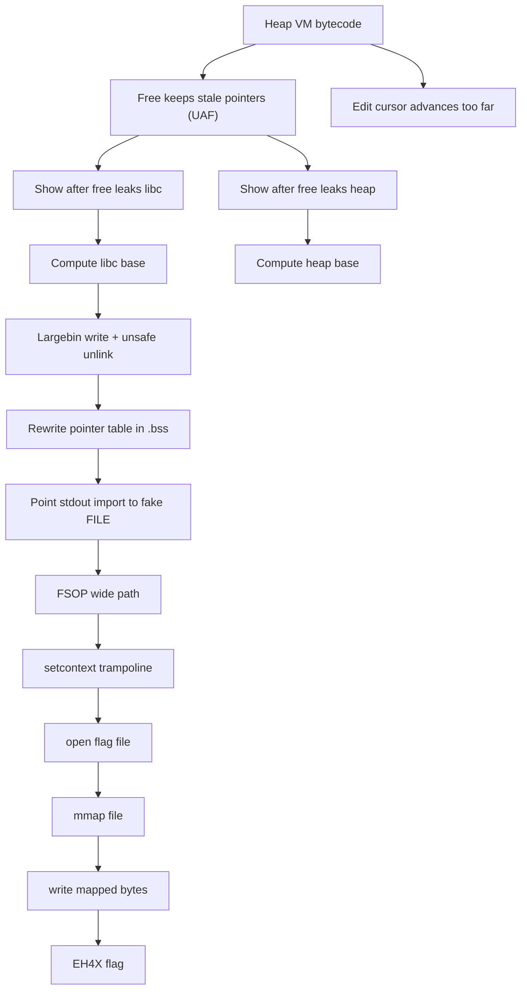
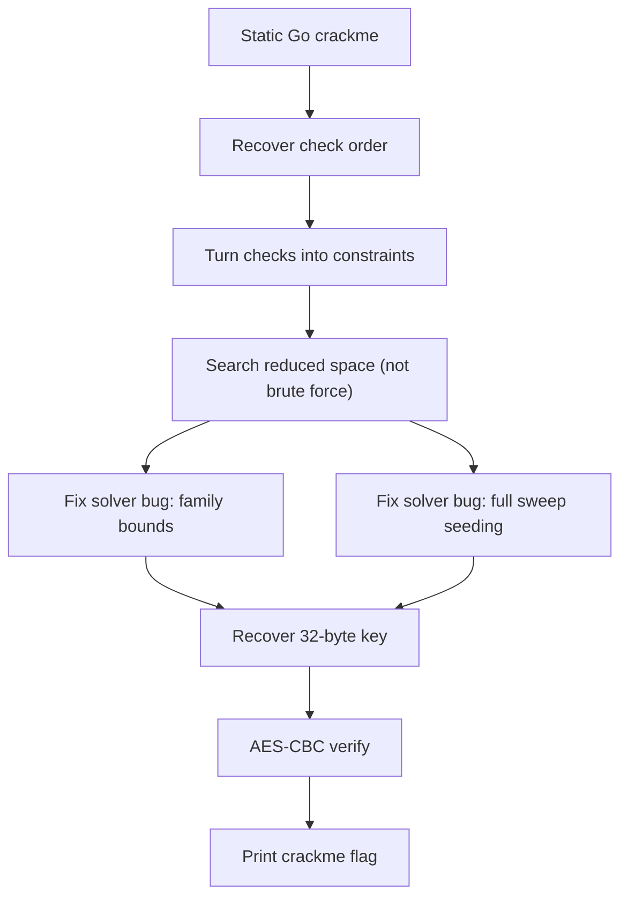

:::caution
Spoilers ahead. This post includes solution details (and flags).
:::

EHAX CTF 2026 was very challenging, but also really fun. Some tasks looked scary at first, but they became manageable after I slowed down and focused on evidence.

Here are four writeups I enjoyed the most.

---

## [Forensics] Quantum Message

The prompt looked like a physics question, but the real clue was: "who did he call?" and a weird pair of numbers.

At first I treated the file like normal audio. Then I opened a spectrogram and noticed something that looked too clean to be random: the sound was made of **blocks**, and each block had **two stable tones**.


### A few extra details

- It was a mono WAV at 44.1 kHz and about 82 seconds long.
- The tone blocks were separated by tiny silence gaps (around 20 ms). I counted **80** blocks, so it felt like a clocked symbol stream.
- The frequencies clustered into stable bins (3 low tones x 4 high tones = 12 symbols).

```text
low bins:  ~301, ~902, ~1503
high bins: ~2104, ~2705, ~3306, ~3907
```

### What worked

- Split the WAV into segments using the short silent gaps.
- For each segment, extract the two dominant frequencies.
- Treat each (low, high) pair like a keypad symbol (similar idea to DTMF, but custom bins).
- Convert the symbol stream into digits, then parse the digits as concatenated ASCII codes.

:::important
The final ASCII parsing had exactly one valid solution, which was a great sanity check.
:::

:::note[Flag]
`EH4X{qu4ntum_phys1c5_15_50_5c4ry}`
:::

### Concept map



---

## [Misc] Entropic Labyrinth

This challenge was a Windows game (`game.exe`) with a "brainrot" hint. The fastest progress came from a simple question: *is this a native game, or a packaged script?*

Strings gave it away: it looked like a **PyInstaller** bundle. So instead of reversing assembly, I switched to extracting the embedded Python code.

One nice part here is that the expected output format was clear (`EH4X{...}`), so I could keep my search honest.

### What worked

- Identify PyInstaller fingerprints in the binary.
- Extract the embedded `game` module / code object.
- Find the encoded constant (a hex string) and the decryption function.
- Try small reversible transforms until the output starts with `EH4X{`.

In the end, it was just a single-byte XOR.

```text
encoded hex: 525f234f6c50235a24482644485545275c24596a
key: 0x17
```

:::note[Flag]
`EH4X{G4M3_1S_BR0K3N}`
:::

### Concept map



::github{repo="pyinstaller/pyinstaller"}

---

## [Pwn] The Revenge of Womp Womp

This one was the hardest for me, but also the most satisfying. The program implements a tiny bytecode-like "heap VM" where you can allocate, free, show, and edit chunks.

Two small bugs were the start of everything:

- After `free`, the program did not clear the pointer (so I could still `show` / `edit` freed chunks).
- The bytecode parser advanced by the *requested* edit length, not the *actual* copied length (so I could desync the parser).

From those, I built two early leaks that made the rest possible:

- a libc leak from unsorted-bin metadata
- a heap leak from freed chunk headers

### What made it tricky

I reached code execution, but the usual endgames failed.

:::warning
Seccomp blocked `execve`, and it also restricted `read(fd, ...)` for normal file descriptors.
:::

So I changed the goal: instead of "spawn a shell" or "ORW", I used a path that avoids `read` entirely:

1. `open("./flag")`
2. `mmap(fd, ...)`
3. `write(1, mapped, ...)`

That was the moment it finally clicked.

:::tip
One detail I wish I noticed earlier: for FSOP, the important target was the program's imported `stdout` pointer cell (not the libc `stdout` symbol).
:::

:::note[Flag]
`EH4X{w0mp_g0t_w0mpp3d_4g41n}`
:::

### Concept map



::github{repo="Gallopsled/pwntools"}

---

## [Rev] ghostKey

`ghostKey` is a crackme-style reverse challenge. The binary wants a **32-byte printable key**, runs many checks, and only then does a final AES-based verification.

The nicest part: it was a Go binary and it still had useful symbol names, so I could map the validation pipeline without a full decompiler.

The key was not "guess the key". It was to understand the structure:

- length must be 32
- all bytes are printable ASCII
- several math checks (pair sums, column sums, tag XOR)
- one LFSR-like update that must land on a fixed value
- a final AES-CBC stage where the decrypted plaintext must start with `crackme{`

### What worked

- Recover the order of checks (length, charset, small math constraints, an LFSR-like update, and an AES stage).
- Turn the validator into a structured search instead of brute force.
- Debug my own solver carefully.

Honestly, the debugging was the real fight.

:::important
A wrong solver is more dangerous than a hard challenge. I had to fix two mistakes before the real key finally showed up.
:::

:::note[Key]
`Gh0stK3y-R3v3rs3-M3-1f-U-C4n!!!!`
:::

:::note[Flag]
`crackme{AES_gh0stk3y_r3v3rs3d!!}`
:::

### Concept map



::github{repo="golang/go"}
