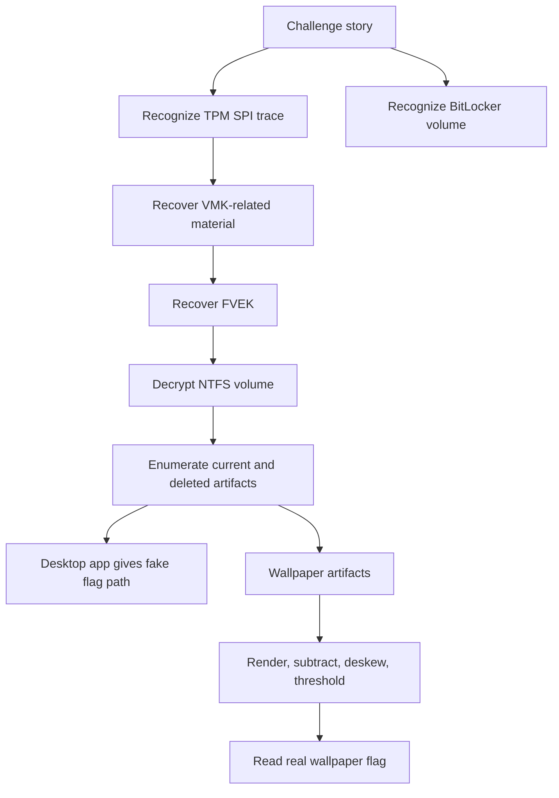
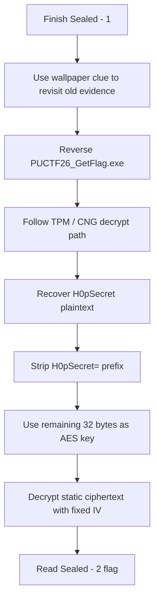

:::caution
Spoilers ahead. This post includes full solve details, intermediate secrets, and final flags.
:::

These two challenges are best read together. `Sealed - 1` gives the hardware trace and the first big forensic pivot, while `Sealed - 2` tells us to go back and finish a path that looked wrong the first time.

I liked this pair a lot because it did not stop at one trick. It started with TPM-adjacent hardware evidence, moved into BitLocker and NTFS forensics, and then ended with a very human lesson: a decoy in one challenge can become the intended path in the sequel.

---

## [Hardware/Forensics] Sealed - 1

`Sealed - 1` is really a chained solve:

1. identify the monitored bus traffic
2. use it to recover BitLocker material
3. decrypt the Windows volume
4. triage current and deleted NTFS artifacts
5. reject a convincing fake flag
6. recover the real one from the wallpaper

### What the challenge was really asking

The prompt said H0p stored secrets on his computer, the disk dump was encrypted, and the "bits" had been monitored. The word *unseal* was the strongest clue in the whole prompt. It pushed me toward TPM language right away.

So my mental model was:

- the hardware side is probably a TPM-related trace
- the disk side is probably BitLocker
- the final flag is probably not the first secret I recover

That last point matters. This challenge really wanted patience.

### Step 1: Recognize TPM SPI and BitLocker

The board photos and channel captures looked like a low-pin-count synchronous serial setup. That is the kind of traffic I would expect from TPM over SPI, not random noise.


On the storage side, the Windows partition showed the usual BitLocker signs, including the `-FVE-FS-` marker. At that point, the two halves of the challenge lined up cleanly:

- TPM-related bus traffic on one side
- a BitLocker-protected Windows volume on the other

Even the disk layout helped. The main encrypted partition started at sector `239616`, so once I saw the BitLocker marker there, it became much easier to trust that the hardware trace and the disk image belonged to the same unlock chain.

### Step 2: Recover the useful TPM output

I did not try to understand every transaction by hand. That would have been slow and unnecessary. The better approach was to reconstruct SPI bytes, find transaction boundaries, and look for the boot-time request/response pairs that mattered.

The useful mindset here was:

- do not decode every packet
- identify framing first
- isolate the transactions that look like boot-time secret handling
- search for the output that lets BitLocker continue

One simplified parser looked like this:

```python
def iter_spi_bytes(rows):
    current = []
    for row in rows:
        if row["cs"] == 0:
            current.append(int(row["mosi"], 16))
        elif current:
            yield bytes(current)
            current = []
    if current:
        yield bytes(current)
```

From that path, I recovered VMK-related material:

```text
3667061e911bb81227374972089df1364aa47eb3ec3a8dc72bfcb9d063646d85
```

Then the FVEK material needed to continue:

```text
85e15ed74a363e31236dac637ea6b1d7b11f5fb853967d0993730d68297d34b2
```

:::important
The TPM was not being broken in a pure cryptographic sense. The solve worked because enough of the real boot-time workflow was observable.
:::

That is why I liked this challenge. The TPM still did its job, but the surrounding system leaked enough for me to keep moving.

### Step 3: Decrypt the volume and hunt through NTFS artifacts

Once I had the key material, the challenge changed from hardware to forensics. I decrypted the volume and enumerated both active and deleted records.

From that point on, I treated it like a Windows evidence hunt, not a hardware challenge anymore. That shift in mindset saved time.

The rough workflow looked like this:

```python
bl = BitLockerVolume(Path("bitlkpart.img"), fvek_bytes, 0x11080)
ntfs = NtfsVolume(bl)

for recno in range(ntfs.record_count):
    info = ntfs.parse_record(recno)
    if not info:
        continue
    path = build_path(info)
    if "Users/PUCTF26" in path:
        print(recno, path, info.in_use)
```

The best evidence pivots were:

- deleted PowerShell history
- browser leftovers
- jump lists
- a desktop .NET executable named `PUCTF26_GetFlag.exe`
- wallpaper artifacts

I also liked that the challenge rewarded deleted artifacts instead of only current files. Once the volume was open, the machine had a lot to say.

The PowerShell history showed cleanup behavior, which confirmed the machine owner had tried to remove traces:

```text
powercfg /h off
Get-AppxPackage | Remove-AppxPackage
cd C:\Users\PUCTF26\AppData\Roaming\Microsoft\Windows\PowerShell\PSReadLine\
Remove-Item .\ConsoleHost_history.txt
```

### Step 4: Follow the decoy path, then reject it

The recovered desktop executable looked very promising. It used a later TPM unseal result:

```text
H0pSecret=PUCTF26{FakeFlag?_Or_SthUseful?}
```

That secret unlocked an AES blob and produced a perfect flag-shaped answer. The problem is: it was not the accepted answer for part 1.

This was the exact moment where it was easy to go wrong. If I had stopped at "the app printed something that looks like a flag," I would have missed the real solve completely. The better question was: does this answer fit the full story of the challenge?

This is the point where the challenge got good. The app was not useless, but it was wrong *for this challenge*. That distinction matters because the sequel uses it later.

:::warning
This was the biggest trap in Sealed - 1. A clean-looking string from a desktop app felt authoritative, but it was still a decoy for part 1.
:::

### Step 5: Recover the real flag from the wallpaper

The real path was much simpler than I first expected. After unlocking the volume, I booted the recovered Windows VM and just looked at the desktop wallpaper.

The faint overlaid text was already there on screen:


Once the VM was up, the clue was basically hiding in plain sight. I did not need to go through a heavy image-processing workflow to get the answer. I just had to notice that the wallpaper itself contained the message.

I still kept a differenced image as a supporting check:


But the practical solve was simply: boot the VM, read the wallpaper, and submit the flag.

The real flag was:

:::note[Flag]
`PUCTF26{n0w_y0u_c4n_st4rt_t0_unse4l_h0ps_t00_2566def7125a5ab7699e2f94f8148939}`
:::

### Why this one was good

I liked `Sealed - 1` because it kept changing shape without feeling random. It started as hardware, became disk crypto, then turned into Windows artifact triage, and finally ended with a visual clue. That is a long chain, but every step still felt connected.

### Concept map



---

## [Hardware/Reverse/Forensics] Sealed - 2

`Sealed - 2` is the kind of sequel I enjoy: it does not throw away the first challenge. Instead, it tells me to reinterpret the evidence correctly.

The wallpaper line from part 1 already hinted at the next step:

```text
... now_y0u_c4n_st4rt_t0_unse4l_h0ps_t00 ...
```

In other words: go back to the path that looked wrong before.

### Step 1: Revisit the recovered desktop app

The central artifact here was the recovered executable:

```text
PUCTF26_GetFlag.exe
```

In part 1, it was a decoy. In part 2, it became the intended route.

The important logic from the disassembly was:

```text
ldstr "1337"
call unsigned int8[] class PUCTF26_TPMFlag2.TpmSrkOps::EncryptDecrypt(bool, unsigned int8[], string)
...
ldstr "H0pSecret="
...
callvirt instance void class [mscorlib]System.Security.Cryptography.SymmetricAlgorithm::set_Key(unsigned int8[])
```

That was enough to sketch the full solve:

1. recover the TPM plaintext
2. verify it begins with `H0pSecret=`
3. strip the prefix
4. use the remainder as an AES key
5. decrypt the embedded ciphertext

### Step 2: Follow the TPM/CNG path

The app used the Microsoft Platform Crypto Provider and targeted this key name:

```text
MICROSOFT_PCP_KSP_RSA_SEAL_KEY_3BD1C4BF-004E-4E2F-8A4D-0BF633DCB074
```

That told me the binary was a wrapper around TPM-backed decrypt, not a local fake crypto routine.

From the earlier work, I already had the relevant TPM-unsealed value:

```text
H0pSecret=PUCTF26{FakeFlag?_Or_SthUseful?}
```

The app then removed the prefix and used this exact string as the AES key:

```text
PUCTF26{FakeFlag?_Or_SthUseful?}
```

That string is 32 bytes long, so it fits AES-256 perfectly.

That detail is important. The useful secret is not the whole `H0pSecret=...` line. The app first checks the prefix, then slices it off, then feeds only the remaining 32-byte value into the AES routine. If I had used the whole string as the key, the length would be wrong and the decrypt step would fail.

### Step 3: Extract the IV and ciphertext

The binary also contained static AES parameters:

```text
IV = 51ed936204a522483315bd2f4093ab7d
```

So the IV is 16 bytes, exactly one AES block.

```text
ciphertext =
5ca1c7cc1ca2b227c96da509771e72430f98393377ee535f291c4b98e6b47c35
a03b926b66fa32984d2e215df960b8ec3cadd340757ac8152c52f4db7515ad95
8febc7341e195ccf2fcc1b3424dcbf0c5afd976a1c26ab3545655612f48ce923
9973e9b407c6d373ac7e1fe2db32a7cc653c2d9597c7e93ab36d8bcd8ad06407
```

The ciphertext is 128 bytes total, which means 8 AES blocks. That already matches the way the .NET app handles a fixed encrypted blob instead of streaming data from somewhere else.

At this point the hardware part was already done. The rest was just careful reversing and one final crypto step.

### Step 4: Decrypt the final payload

I reproduced the app's AES-CBC logic with a tiny Python script:

```python
from Crypto.Cipher import AES

key = b"PUCTF26{FakeFlag?_Or_SthUseful?}"
iv = bytes.fromhex("51ed936204a522483315bd2f4093ab7d")
ciphertext = bytes.fromhex(
    "5ca1c7cc1ca2b227c96da509771e7243"
    "0f98393377ee535f291c4b98e6b47c35"
    "a03b926b66fa32984d2e215df960b8ec"
    "3cadd340757ac8152c52f4db7515ad95"
    "8febc7341e195ccf2fcc1b3424dcbf0c"
    "5afd976a1c26ab3545655612f48ce923"
    "9973e9b407c6d373ac7e1fe2db32a7cc"
    "653c2d9597c7e93ab36d8bcd8ad06407"
)

plaintext = AES.new(key, AES.MODE_CBC, iv).decrypt(ciphertext)
pad = plaintext[-1]
plaintext = plaintext[:-pad]
print(plaintext.decode())
```

The important technical points are:

- `AES.MODE_CBC` matches the behavior recovered from the program
- the key is the UTF-8 bytes of `PUCTF26{FakeFlag?_Or_SthUseful?}`
- the IV is fixed, not derived at runtime
- after decryption, the last byte is the PKCS#7 padding length, so I remove that many bytes from the end

In other words, the final step is not "break the cipher." It is simply reproducing the exact parameters the application already uses.

If I wanted to sanity-check the chain before running code, I could verify it like this:

```python
assert len(key) == 32
assert len(iv) == 16
assert len(ciphertext) % 16 == 0
```

Once those checks pass, the decrypt path is very straightforward.

The output was the accepted flag:

:::note[Flag]
`PUCTF26{Us1ng_St0rageR00tKey_with_4symm3tr1c_c1pher_1n_TPM_d0es_n0t_m34n_4bs0lutely_s4f3_82adc0d7e4137c3c4c663eb3a68172b4}`
:::

### Unintended-looking path, but intended sequel

This is the part I would highlight most in a writeup. The same `H0pSecret` path was:

- misleading for `Sealed - 1`
- necessary for `Sealed - 2`

That is why keeping notes on "wrong" paths matters. Sometimes they are not wrong in general. They are only wrong for the current part.

### Concept map



---

## References

- [TPM 2.0 Library Specification](https://trustedcomputinggroup.org/resource/tpm-library-specification/) - official TCG entry point for the TPM 2.0 specs.
- [Trusted Platform Module (TPM) fundamentals](https://learn.microsoft.com/en-us/windows/security/hardware-security/tpm/tpm-fundamentals) - Microsoft overview of TPM roles, keys, and platform security.
- [Cryptography API: Next Generation (CNG) Portal](https://learn.microsoft.com/en-us/windows/win32/seccng/cng-portal) - official Microsoft documentation for the Windows cryptography stack.
- [TPM Platform Crypto-Provider Toolkit](https://www.microsoft.com/en-us/download/details.aspx?id=52487) - Microsoft toolkit and sample material for the Platform Crypto Provider path used in Windows.
- [BitLocker overview](https://learn.microsoft.com/en-us/windows/security/operating-system-security/data-protection/bitlocker/) - Microsoft overview of BitLocker architecture and deployment.
- [A Deep Dive into TPM-based BitLocker Drive Encryption](https://itm4n.github.io/tpm-based-bitlocker/) - a practical technical writeup on TPM-protected BitLocker behavior and attack surface.
- [NIST SP 800-38A](https://nvlpubs.nist.gov/nistpubs/legacy/sp/nistspecialpublication800-38a.pdf) - the standard reference for block cipher modes including CBC.
- [MFTECmd](https://ericzimmerman.github.io/#!index.md) - Eric Zimmerman's NTFS/MFT tooling and documentation, useful for deleted-file and artifact triage workflows.
