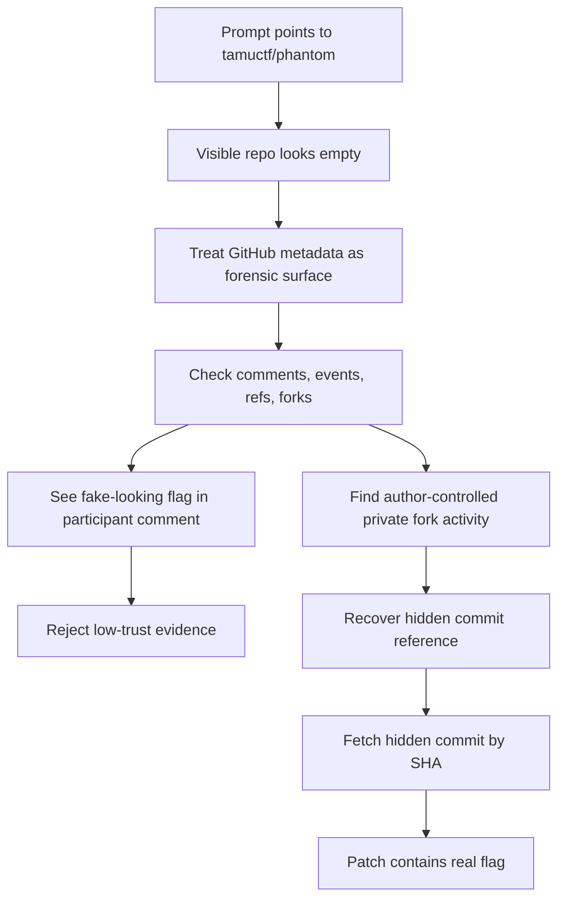
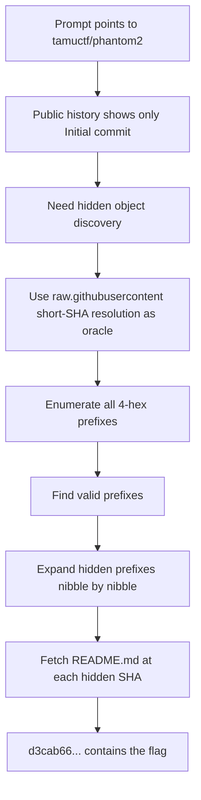
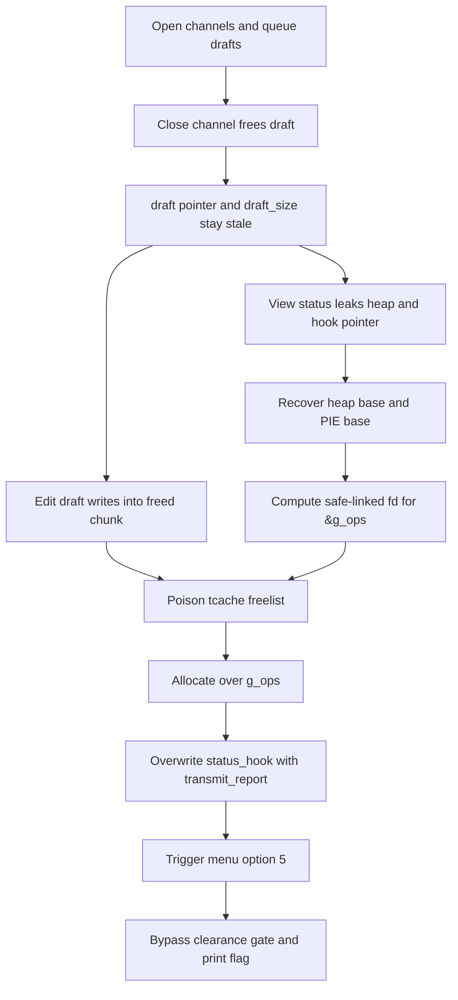

:::caution
Spoilers ahead. This post includes solution details, payloads, and flags.
:::

TAMUctf 2026 was a lot of fun. The challenges I picked for this post all had the same thing I like most in CTFs: the first idea was not enough, and the real solve only became clear after I asked better questions.

In this post, I am collecting two forensics challenges that used GitHub itself as the evidence source, plus one heap pwn that turned stale metadata into a clean function-pointer hijack.

---

## [Forensics] Phantom

`Phantom` is one of those challenges that looks almost empty at first. The prompt only pointed to a GitHub repository, so the important move was to stop thinking about files and start thinking about metadata.

### What made this challenge interesting

The visible repository tree was basically useless. That was the trap. The real artifact was not the `README.md` in the repo. The real artifact was the whole GitHub surface around it:

- commits
- refs
- comments
- events
- forks

That changed the challenge from "find the flag in the repo" to "figure out which GitHub evidence is trustworthy."

### Step 1: Confirm that the visible repo is too small

The first pass was very simple:

```bash
curl -L --silent https://api.github.com/repos/tamuctf/phantom/contents
curl -L --silent https://api.github.com/repos/tamuctf/phantom/commits
```

The main observations were:

- the challenge pointed to `https://github.com/tamuctf/phantom`
- the repo only exposed a tiny `README.md`
- the default branch only showed one visible commit

So the public tree alone was clearly not the answer.

### Step 2: Expand the evidence surface

Once I treated GitHub as the forensic artifact, I started checking everything public that GitHub exposes:

```bash
curl -L --silent https://api.github.com/repos/tamuctf/phantom/issues
curl -L --silent https://api.github.com/repos/tamuctf/phantom/comments
curl -L --silent https://api.github.com/repos/tamuctf/phantom/pulls
curl -L --silent https://api.github.com/repos/tamuctf/phantom/events
curl -L --silent https://api.github.com/repos/tamuctf/phantom/git/refs
```

This produced one very tempting flag-looking string:

```text
gigem{u_find_it_bro_bye_bye}
```

But I rejected it for a simple reason: it came from a participant comment, not from the author.

:::warning
This challenge had noisy evidence on purpose. A string that looks like a flag is not enough if the source is weak.
:::

### Step 3: Follow author-controlled signals

The event feed was the turning point:

```bash
curl -L --silent 'https://api.github.com/repos/tamuctf/phantom/events?per_page=100'
curl -L --silent 'https://api.github.com/orgs/tamuctf/events?per_page=100'
```

From there, I found that the author account `cobradev4` had created a private fork before the public solve noise started. That strongly suggested hidden history still existed somewhere.

The most important clue was a hidden commit reference:

```text
b365313472870cbf887a42a7be75df741b60c8d3
```

So I fetched that commit directly:

```bash
curl -L --silent \
  https://api.github.com/repos/tamuctf/phantom/commits/b365313472870cbf887a42a7be75df741b60c8d3
```

That returned a full commit object, even though it was not reachable from the public branch tips.

The key details were:

```text
author: Noah Mustoe <62711423+cobradev4@users.noreply.github.com>
date: 2026-03-16T02:02:46Z
message: Add flag
```

And the patch itself contained the flag.

### Why this was the right flag

I trusted this artifact because it was:

- author-created
- dated before public player contamination
- clearly labeled with `Add flag`
- recoverable from a hidden commit object, which matched the challenge idea perfectly

That was much stronger evidence than a participant saying "this one is real" or "this one is fake."

### Concept map



:::note[Flag]
`gigem{917hu8_f02k5_423_v32y_1n7323571n9_1d60b3}`
:::

::github{repo="tamuctf/phantom"}

---

## [Forensics] Phantom 2

`Phantom 2` takes the first idea and makes it stricter. In the first challenge, a hidden commit SHA leaked through metadata. In the second one, the SHA was not handed to me so directly. I had to build an oracle and recover hidden commits prefix by prefix.

### What changed from the first challenge

This time, the public history looked even cleaner:

- the public repo only had the `Initial commit`
- there was no easy full hidden SHA to grab immediately
- I had to prove that hidden commit objects existed before I could recover them

That made the solve feel much more methodical.

### Step 1: Confirm the public state

I started by verifying what was normally reachable:

```bash
git clone https://github.com/tamuctf/phantom2 repo
cd repo
git log --oneline --all
```

Only one commit appeared publicly:

```text
454b12bba923297b4af5582a49cd8a3e20986ea1
```

So if the flag existed in Git history, it had to be somewhere outside the normal branch view.

### Step 2: Build a short-SHA oracle

Direct high-rate queries against the normal GitHub endpoints got throttled, so the cleaner path was `raw.githubusercontent.com`.

The key idea was:

```text
https://raw.githubusercontent.com/tamuctf/phantom2/<prefix>/README.md
```

Behavior:

- `200` means the short prefix resolves to a reachable commit where `README.md` exists
- `404` means no such resolution
- prefixes shorter than 4 hex chars do not resolve

That gave me a very usable existence oracle.

### Step 3: Enumerate 4-hex prefixes

I scanned all `0000` to `ffff` prefixes and found five valid ones:

```text
432c
454b
b36f
d3ca
dd21
```

Two were already known public/reachable values, which meant the other prefixes were the interesting ones.

### Step 4: Expand hidden prefixes to full SHAs

For each hidden prefix, I extended one nibble at a time:

1. try `prefix + [0..f]`
2. keep the only nibble that returns `200`
3. repeat until the SHA reaches 40 hex characters

That recovered the hidden SHAs, including:

```text
d3cab66d23265b36ecd8cd410554bdfc603e3416
```

Then I fetched the content at each hidden commit:

```bash
curl -L "https://raw.githubusercontent.com/tamuctf/phantom2/<sha>/README.md"
```

The winning one was `d3cab66...`, because its `README.md` contained the flag.

### Step 5: Confirm with commit metadata

I still wanted one more layer of proof, so I checked the commit metadata and patch. That confirmed:

- the message was `Add flag (if you comment on this commit, you will be banned)`
- the modified file was `README.md`
- the patch contained the same flag string

That was enough to treat it as the final answer.

:::important
The smart part of this challenge is that it was not really about brute force. It was about turning GitHub's object-resolution behavior into a clean oracle.
:::

### Concept map



:::note[Flag]
`gigem{57up1d_917hu8_3v3n7_4p1_a8f943}`
:::

::github{repo="tamuctf/phantom2"}

---

## [Pwn] military-system

`military-system` was the most traditional challenge in this set, but it was still very satisfying. The bug chain was clean: stale draft metadata gave me a use-after-free, that gave me leaks, and the leaks gave me the tcache poison I needed.

### What made this one approachable

The binary was not stripped and still had DWARF debug info. That saved a lot of time.

From the first recon pass, I could recover:

- struct layouts
- handler names
- global symbols like `g_channels`, `g_auth`, and `g_ops`

That made the exploit path much easier to reason about.

### Step 1: Reconnaissance

The first pass was the usual survey:

```bash
file military-system
checksec file military-system
nm -C military-system
llvm-dwarfdump --debug-info military-system
strings -tx military-system | less
```

The important facts were:

- `aarch64`
- PIE, full RELRO, NX, canary
- dynamic glibc binary
- debug symbols and DWARF still present

That immediately told me I should spend more time understanding the program state than fighting blind disassembly.

### Step 2: Find the stale metadata bug

The core bug chain came from channel drafts.

Simplified logic looked like this:

```c
if (channel->draft) {
    free(channel->draft);
}

channel->open = 0;
```

But the program did **not** clear:

- `channel->draft`
- `channel->draft_size`

So after `close_channel`, the program still trusted stale draft metadata in:

- `view_status`
- `edit_draft`

That gave me:

1. an information leak
2. a write primitive on freed memory

### Step 3: Leak heap and PIE

The closed-channel status output already gave the exact values I needed:

```text
[STATUS] last_draft=0x55000218e0
[STATUS] diagnostic_hook=0x55000017a0
```

From there I computed:

```text
pie_base         = diagnostic_hook - 0x17a0
g_ops            = pie_base + 0x20020
transmit_report  = pie_base + 0x1274
encoded_fd       = g_ops ^ (last_draft >> 12)
```

So the status screen was effectively leaking both the heap side and the code side of the exploit.

### Step 4: Poison tcache and overwrite the hook

The exploit plan became very direct:

1. open two channels
2. queue same-sized drafts
3. close both channels so the chunks are freed
4. leak `last_draft` and `diagnostic_hook`
5. use stale `edit_draft` to poison the freed chunk's `fd`
6. allocate twice until a chunk overlaps `g_ops`
7. overwrite `status_hook` with `transmit_report`
8. trigger menu option 5

The important idea is that I did **not** try to satisfy the `g_auth` clearance logic. I just skipped it by jumping into the flag-reading routine through another path.

### Step 5: Trigger the indirect call

The final trigger was simple. Once `status_hook` pointed to `transmit_report`, menu option 5 became my flag path:

```text
Slot: [PATRIOT-7] Transmitting sealed report:
gigem{st4le_dr4ft_tcache_auth_bypass}
```

That completed the chain:

- stale pointer after free
- heap leak
- PIE leak
- safe-link-aware tcache poison
- function-pointer overwrite
- auth bypass

### Why the exploit works

I like this one because every step is really a trust failure:

1. the program trusted metadata after `free`
2. it trusted a stale pointer for status output
3. it trusted a stale pointer for editing
4. it trusted a global callback pointer
5. it assumed only the "authorized" menu path could reach `transmit_report`

Once the first assumption broke, the rest followed quite naturally.

### Concept map



:::note[Flag]
`gigem{st4le_dr4ft_tcache_auth_bypass}`
:::

::github{repo="Gallopsled/pwntools"}

---

## References

- [GitHub REST API: Commits](https://docs.github.com/en/rest/commits/commits)
- [GitHub REST API: Repository Events](https://docs.github.com/en/rest/activity/events)
- [Git Internals - Git Objects](https://git-scm.com/book/en/v2/Git-Internals-Git-Objects)
- [glibc malloc internals](https://sourceware.org/glibc/wiki/MallocInternals)
- [Safe-Linking: Eliminating a 20 year-old malloc exploit primitive](https://research.checkpoint.com/2020/safe-linking-eliminating-a-20-year-old-malloc-exploit-primitive/)
- [pwntools documentation](https://docs.pwntools.com/)
